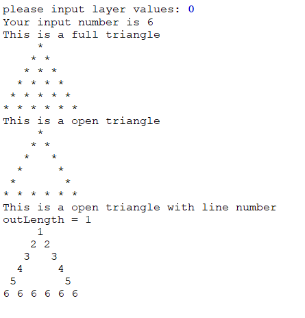
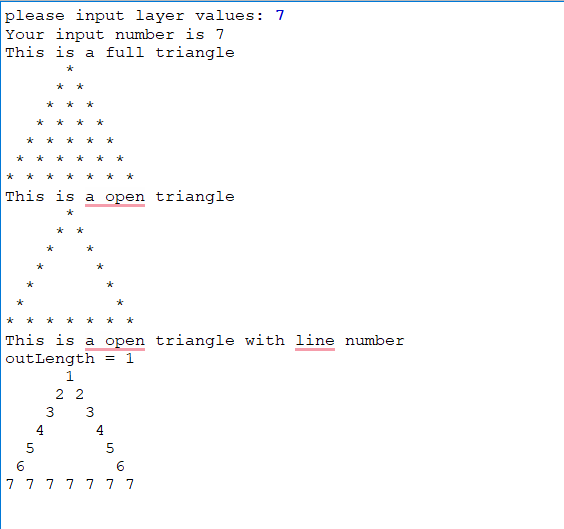
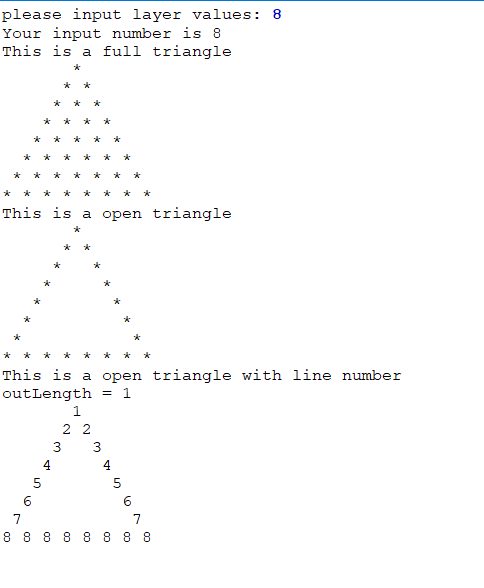
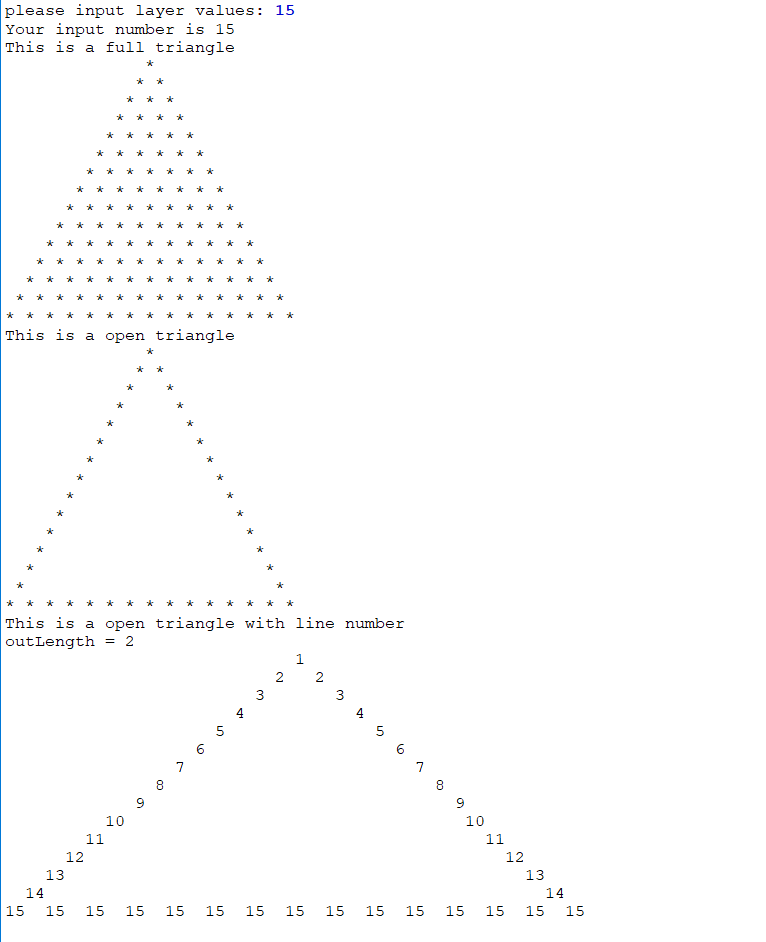
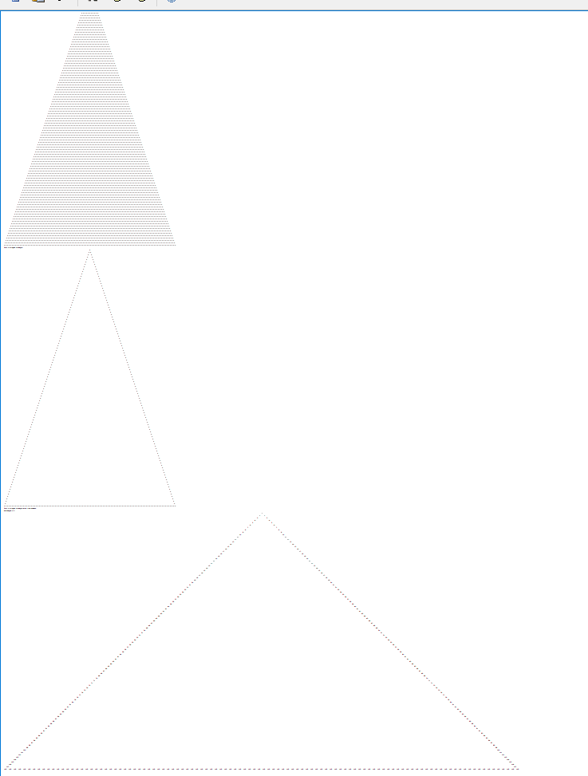
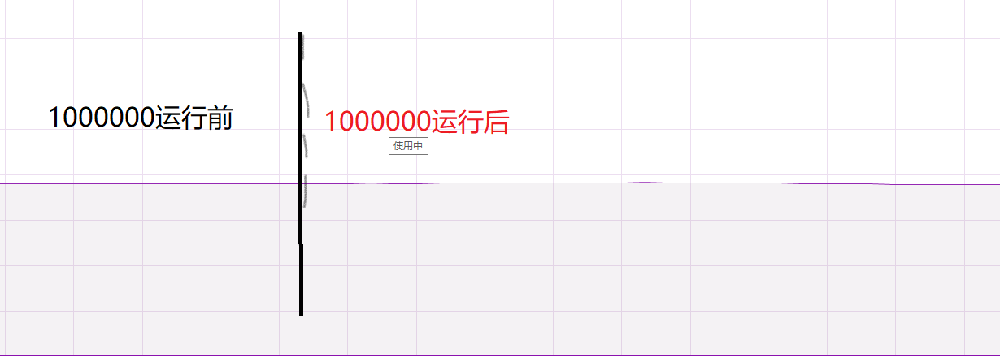

# 开胃菜小程序

## 输出三角形小程序，如果输入为零，默认输出6层

------------------------

### 薛老师课堂讲解
```c++
for (int i = layer; j >= 0; i--){
    for (int j = -layer; j <= layer; j++){
        int sum = abs(i)+abs(j);
        if (sum <= layer && (sum - 1)$2 == 0 && i==0){
            cout << "*";
        }
    }
    cout << endl;
}
```
假设要输入 $n$ 层结构，那么事实上外层（$i$ 层）for循环迭代了 $i+1$ 次。

------------------------


### 个人解决方法
本人喜欢直接的方式，更倾向于输出几层就在 for 循环迭代几次，因此采用下面形式。
```c++
    if(layer % 2 == 1){
        for(int i = layer; i > 0; i--){
            for (int j = -layer+1 ; j < layer; j++){
                int sumIJ = abs(i)+abs(j);
                if((sumIJ == layer) || (i==0+1 && abs(j) % 2 == 0)){
                    cout << "*";
                } else{
                    cout << " ";
                }
            }
            cout << endl;
        }
    }
    else{
        for(int i = layer; i > 0; i--){
            for (int j = -layer+1 ; j < layer; j++){
                int sumIJ = abs(i)+abs(j);
                if((sumIJ == layer) || (i==0+1 && abs(j) % 2 == 1)){
                    cout << "*";
                } else{
                    cout << " ";
                }
            }
            cout << endl;
        }
    }
```
因为在实现过程中，这种输出几层，外循环就迭代几次的方式 **奇数偶数有区别** ，**因此进行了层数奇偶的判断**。相比于薛老师的版本，代码量更大，**但是从我的角度，这样更加简单直白**。

------------------------

### 输出层数为 $0$ 的时候
```c++
cout << "please input layer values: ";
cin >> layer;
//    layer == 0? (layer = 6) : (layer=layer+0);
layer = (layer == 0? 6:layer);
```

采用这个方式将输入为 $0$ 限制为 $6$ 层。

-----------------------

### 输出为数字，格式化问题
当输出三角形元素为数字时，采用头文件为 `<iomanip>,<cmath>` 的`setw(),log10()` 函数进行定宽格式化。

```c++
    outLength =  log10(layer) + 1; // 定宽
    cout << "outLength = " <<outLength<< endl;

    if(layer % 2 == 1){
        for(int i = layer; i > 0; i--){
            for (int j = -layer+1 ; j < layer; j++){
                int sumIJ = abs(i)+abs(j);
                if((sumIJ == layer) || (i==0+1 && abs(j) % 2 == 0)){
//                    cout.width(outLength);
                    cout << setw(outLength)<< layer-i+1;
                } else{
                    cout << setw(outLength)<< " ";
                }
            }
            cout << endl;
        }
    }
    else{
        for(int i = layer; i > 0; i--){
            for (int j = -layer+1 ; j < layer; j++){
                int sumIJ = abs(i)+abs(j);
                if((sumIJ == layer) || (i==0+1 && abs(j) % 2 == 1)){
//                    cout.width(outLength);
                    cout << setw(outLength)<< layer-i+1;
                } else{
                    cout << setw(outLength)<< " ";
                }
            }
            cout << endl;
        }
    }
```

--------------------------

### 程序运行结果
##### 输入为0，应该输出六层

##### 输入为奇偶数时，保证正确性


##### 输入为两位数 15

##### 输入为三位数 108

##### 输入为1000000，内存占用测试

可以看到并不额外占用内存空间。