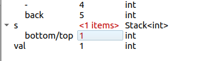

# 作业二，记录
---------------------------------

## 第一部分 热身

### Q1：在调试变量面板中，Stack 使用 top 和 bottom 标签标记栈的两端。那么当 Stack 仅包含一个元素时，这两个标签将如何显示？

仅有一个元素，这样显示 `bottom/top`，栈顶和栈底重合



### Q2：具体是什么情况，会造成函数无限循环执行？


应该是第一个为负值，造成无限循环？事实上我的原来的程序并没有无限循环。可能是测试执行过程中自动终止了。但是通过debug，大概可以判断第一个值为负，会无限循环。

### Q3：解释下你编辑过的代码是如何修复 duplicateNegatives 中的问题的。
队列的长度是随着新增添的元素而变化的，就导致队列尺寸一直变大，达不到终止条件
```c++
void duplicateNegatives(Queue<int>& q) {
    long lengthQ = q.size();
    // 把队列长度改为固定，即初始长度即可
    for (int i = 0; i < lengthQ; i++) {
        int val = q.dequeue();
        q.enqueue(val);
        if (val < 0) {
            q.enqueue(val);   // double up on negative numbers
        }
    }
}
```

写一个测试，全部通过
```c++
STUDENT_TEST("duplicateNegatives, minimum test( and then I modified the program)"
             ", input has one negative, one positive") {
    Queue<int> q = {7, 9};
    Queue<int> expected = {7, 9};
    duplicateNegatives(q);
    EXPECT_EQUAL(q, expected);
    //    ---------------------------------------------------------------
    q = {12,-22};
    expected={12,-22,-22};
    duplicateNegatives(q);
    EXPECT_EQUAL(q, expected);
    //    ---------------------------------------------------------------
    q = {-1,2};
    expected={-1,-1,2};
    duplicateNegatives(q);
    EXPECT_EQUAL(q, expected);
    //    ---------------------------------------------------------------
    q = {1,2,-2};
    expected={1,2,-2,-2};
    duplicateNegatives(q);
    EXPECT_EQUAL(q, expected);
    //    ---------------------------------------------------------------
    q = {-1,3,-5,-10,22,2};
    expected={-1,-1,3,-5,-5,-10,-10,22,2};
    duplicateNegatives(q);
    EXPECT_EQUAL(q, expected);
}
```


### Q4：思考下如何更好的修复 sumStack 中的 bug？
1. 首先，改成这样，空数组也可以工作了
```c++
int sumStack(Stack<int> s) {
// if s is empty, return 0 and break the subprogram
    if (s.isEmpty()) {
        return 0;
    }
    int total = s.pop();
    while (!s.isEmpty()) {
        total += s.pop();
    }
    return total;
}
```
2. 然后还有其他什么方法呢？
   + 只要在定义变量 `total` 的时候，将其初始化为零，而不是弹出一个栈值，就能避免弹出空栈的错误。
   + 然后将弹出第一个值放到 `while` 的判断里面，就解决了这个问题。
```c++
int sumStack(Stack<int> s) {

    int total = 0;
    while (!s.isEmpty()) {
        total += s.pop();
    }
    return total;
}
```

-------------------------------------
## 第二部分 迷宫


第一个任务是实现寻找当前位置的所有相邻位置的辅助函数：

#### 写好函数并添加了其他三个 `STUDENT_TEST` 测试
```c++
Set<GridLocation> generateValidMoves(Grid<bool>& maze, GridLocation cur) {
    Set<GridLocation> neighbors;

    /* TODO: Fill in the remainder of this function. */

    if (maze.isEmpty()){
        return neighbors;
    }

    GridLocation neighborsEast = {cur.row+1,cur.col+0};
    GridLocation neighborsWest = {cur.row-1,cur.col+0};
    GridLocation neighborsSorth = {cur.row+0,cur.col-1};
    GridLocation neighborsNorth = {cur.row+0,cur.col+1};
    if(maze.inBounds(neighborsEast) && maze.get(neighborsEast) == 1){
        neighbors.add(neighborsEast);
    }
    if(maze.inBounds(neighborsWest) && maze.get(neighborsWest) == 1){
        neighbors.add(neighborsWest);
    }
    if(maze.inBounds(neighborsSorth) && maze.get(neighborsSorth) == 1){
        neighbors.add(neighborsSorth);
    }
    if(maze.inBounds(neighborsNorth) && maze.get(neighborsNorth) == 1){
        neighbors.add(neighborsNorth);
    }

    return neighbors;
}

STUDENT_TEST("generateValidMoves on location on the side of 0x0 grid with no walls") {
    Grid<bool> maze = {};
    GridLocation side = {0, 1};
    Set<GridLocation> expected = {};
    EXPECT_EQUAL(generateValidMoves(maze, side), expected);
}

STUDENT_TEST("generateValidMoves on location on the side of 3x3 grid with walls") {
    Grid<bool> maze = {{false, false, true},
                       {false, true, true},
                       {true, true, true}};
    GridLocation side = {0, 1};
    Set<GridLocation> expected = {{0,2}, {1, 1}};

    EXPECT_EQUAL(generateValidMoves(maze, side), expected);
}
STUDENT_TEST("generateValidMoves on location on the side of 3x3 grid with walls") {
    Grid<bool> maze = {{false, false, true},
                       {false, true, true},
                       {true, true, true}};
    GridLocation side = {5, 1};
    Set<GridLocation> expected = {};

    EXPECT_EQUAL(generateValidMoves(maze, side), expected);
}
```


### Q5：讲义中提到，以引用的方式来传递比较大的数据结构是更有效率的方式。那么，为什么在函数中`validatePath`，传递参数 `path` 时采用的是传值而不是传递引用呢？
因为在 程序 `validatePath()` 中，可能会有 `pop` 操作，如果传递引用，会改变原来的 `path` 值， 破坏了原始参数。为了保险起见，传值。


### Q6：写完测试后，描述下你的测试策略是如何确保 validatePath 正确工作的。

给了三个测试代码，
1. 解为空，那么 `EXPECT_ERROR` 将会报错，测试通过；
1. 对一个特定Maze 给一个错误的解，那么 `EXPECT_ERROR` 将会报错，测试通过；
2. 对一个大型的Maze，给一个正确的解，程序不会报错，`EXPECT_NO_ERROR` 测试通过。
```c++
STUDENT_TEST("validatePath on EMPTY path should raise error")
{
    Grid<bool> maze = {{true, false},
                       {true, true}};
    Stack<GridLocation> empty_path = {};

    EXPECT_ERROR(validatePath(maze, empty_path));
}
STUDENT_TEST("validatePath on 5x7 path but 25x33 solution should raise error")
{
    Grid<bool> maze;
    Stack<GridLocation> soln;
    readMazeFile("res/5x7.maze", maze);
    readSolutionFile("res/25x33.soln", soln);

    EXPECT_ERROR(validatePath(maze, soln));
}
STUDENT_TEST("validatePath on correct solution loaded from file for 19x35 path")
{
    Grid<bool> maze;
    Stack<GridLocation> soln;
    readMazeFile("res/19x35.maze", maze);
    readSolutionFile("res/19x35.soln", soln);
    EXPECT_NO_ERROR(validatePath(maze, soln));
}
```


先把程序 `solveMaze` 正确的结果记录下来
```c++
/* TODO: Replace this comment with a descriptive function
 * header comment.
 */
Stack<GridLocation> solveMaze(Grid<bool> &maze)
{
    MazeGraphics::drawGrid(maze);
    Stack<GridLocation> path;
    /* TODO: Fill in the remainder of this function. */

    // add a empty queue to contain path
    Queue<Stack<GridLocation>> recordPath;
    // a stack with the only one location, entry
    GridLocation entry={0,0};
    Stack<GridLocation> pathOnlyEntry = {entry};
    // a stack with the only one location, exit.
    // and then the exit is used to judge the break(return result) of the subprogram
    GridLocation exit={maze.numRows()-1,maze.numCols()-1};
    // add the path only with entry to the queue
    recordPath.enqueue(pathOnlyEntry);
    // create a set to contain the locations that have been passed
    Set<GridLocation> locationsHaveBeenPassed;
    locationsHaveBeenPassed.add(entry);

    // set search radius
    long level = 1;

    // assume the recordPath is not empty, then search
    while (!recordPath.isEmpty())
    {
        // get the length of the recordPath queue
        int sizeQueue = recordPath.size();

        // iterate through the queue and add the possible next location to the new path stack
        for (int i = 0; i < sizeQueue; i++)
        {
            // take out the first element of the path queue
            Stack<GridLocation> thisPath = recordPath.dequeue();
            
            // if the last element of the current stack is the exit, then return and baeak the subprogram.
            if ((thisPath.peek()).toString() == exit.toString())
            {
                // assign value to the path that needs to be returneds
                path = thisPath;
                MazeGraphics::highlightPath(path, "green", 200);
                cout << "the length of the result path is " << ++level << endl;
                return path;
            }
            // get the neighbors of the last element of the current path stack
            Set<GridLocation> thisNeighbors = generateValidMoves(maze, thisPath.peek());


            // int sizeNei = thisNeighbors.size();
            // iterate through the neighbors and add each element to the possible path
            foreach (GridLocation nei, thisNeighbors)
            {
                // judge whether the path which has been passed contained this neighbor
                if (!locationsHaveBeenPassed.contains(nei))
                {
                    // if not, add the neighbor to the path that has been passed
                    locationsHaveBeenPassed += (nei);
                    // add this path to the queue of the possible paths for the next search
                    Stack<GridLocation> nextPath{thisPath};
                    nextPath.push(nei);
                    MazeGraphics::highlightPath(nextPath, "blue", 40);
                    recordPath.enqueue(nextPath);
                }
            }
        }
        level += 1;
    }
    // if we have done all over the while loop and do not return a path, then we conclude there is no result path
    cout << "the length of the result path is 0 after " << level << "'s searching." << endl;
    MazeGraphics::highlightPath(path, "red", 200);
    return path;
}
```


**我可太喜欢这个结果动图了，反复观看**

## 第三部分 搜索引擎

数据结构的错误选择会使搜索变得非常慢，但是巧妙地使用我们出色的 ADT 可以避免这种情况。搜索引擎通常使用称为反向索引的数据组织形式。

第一个 `cleanToken` 函数，没用 `ispunct()` 实现了……
**想不出来用 `ispunct()` 怎么做，希望老师指点一下。**
```c++
// TODO: Add a function header comment here to explain the
// behavior of the function and how you implemented this behavior
string cleanToken(string s)
{
    string result;
    // remove the no letter at the begin
    int i = 0;
    while(i < s.length()){
        if (isalpha(s.at(i))){
            result +=s.at(i);
            break;
        }
        i++;
    }
    if (result == "") return result;
    result.append(s.substr(i+1));
    
    // remove the no letter at the end
    i = result.length()-1;
    while(i >=0 ){

        if (!isalpha(result.at(i))){
            result.erase(i,i);
            i--;
        }else{
            break;
        }
    }
    // letter to lower
    for(int i = 0;i<result.length();i++){
        if(isalpha(result.at(i))){
            char a = result.at(i);
            result.at(i)=tolower(a);
        }
    }
    return result;
}
```

第二个 `gatherTokens` 函数
```c++
// TODO: Add a function header comment here to explain the
// behavior of the function and how you implemented this behavior
Set<string> gatherTokens(string text)
{
    Set<string> tokens;

    Vector<string> allTextString = stringSplit(text, " ");
    foreach (string strText, allTextString) {
        string strClean = cleanToken(strText);
        if(strClean != ""){
            tokens.add(strClean);
        }

    }
    return tokens;
}
```

## Q7：根据 res/tiny.txt 数据库，画出反向索引数据结构的内容。
画出结果


第三个 `buildIndex` 函数
```c++
// TODO: Add a function header comment here to explain the
// behavior of the function and how you implemented this behavior
int buildIndex(string dbfile, Map<string, Set<string>>& index)
{
    // open the file named "dbfile"
    ifstream in;
    if (!openFile(in, dbfile))
        error("Cannot open file named " + dbfile);
    
    // read all the lines of the file into a Vector named "liens"
    Vector<string> lines;
    readEntireFile(in, lines);
    // get the rows number of the vector
    long numRows = lines.size();      // rows is count of lines
    // so the website number is the half of the numRows
    long numWeb = numRows/2;
    // iterate through the Vector, acutally, we iterate two element of the Vector each time
    for (int i = 0;i<numWeb;i++){
        // the web's inedx is i*2
        string webThis = lines.get(2*i);
        // the string set is the element in the index of i*2+1
        string strSetThis = lines.get(2*i+1);
        // get a set of a pure string and remove the empty ones 
        Set<string> gatherStr = gatherTokens(strSetThis);
        // iterate through the set to construct the inverse search index
        foreach (string strThis, gatherStr) {
            // assume the map does not contain the str index
            // then add this couple of (string, web) into the map
            if(index.containsKey(strThis)){
                index[strThis].add(webThis);
                // map.get() is a const member, so we can not use it
                // index.get(strThis).add(webThis);
            }
            // else, just add the web to the value of the key of string which has been in the map
            else{
                Set<string> strThisValue={webThis};
                index.put(strThis, strThisValue);
            }

        }
    }
    return numWeb;
}
```
自己做了两个测试也通过了
```c++
STUDENT_TEST("buildIndex test of Mine") {
    Map<string, Set<string>> index;
    int nPages = buildIndex("res/tiny.txt", index);

    EXPECT(index.get("fish").contains("www.shoppinglist.com"));
    EXPECT(index.get("fish").contains("www.dr.seuss.net"));
    EXPECT(index.get("fish").contains("www.bigbadwolf.com"));
    EXPECT(index.get("blue").contains("www.rainbow.org"));
    EXPECT(index.get("blue").contains("www.dr.seuss.net"));
}
STUDENT_TEST("buildIndex test of website.txt") {
    Map<string, Set<string>> index;
    int nPages = buildIndex("res/website.txt", index);
    EXPECT_EQUAL(nPages, 32);

    EXPECT(index.get("practice").contains("http://cs106b.stanford.edu/class/cs106b/about_assessments"));
    EXPECT(index.get("policy").contains("http://cs106b.stanford.edu/class/cs106b/about_assignments"));
    EXPECT(index.get("video").contains("http://cs106b.stanford.edu/class/cs106b/about_lectures"));
    EXPECT(index.get("better").contains("http://cs106b.stanford.edu/class/cs106b/assignments/2-adt/warmup.html"));
    EXPECT(index.get("point").contains("http://cs106b.stanford.edu/class/cs106b/resources/testing_guide.html"));
}
```


函数 `findQueryMatches`
```cpp
// TODO: Add a function header comment here to explain the
// behavior of the function and how you implemented this behavior
Set<string> findQueryMatches(Map<string, Set<string>> &index, string query)
{
    Set<string> result;
    // TODO: your code here
    // split the string of query
    Vector<string> queryVector = stringSplit(query, " ");
    // temporary set of the result
    Set<string> querySet = {};
    // the temporary set of the next finding string, we should use this to compute with the querySet
    Set<string> querySetNext = {};
    querySet.unionWith(index.get(cleanToken(queryVector.get(0))));

// temporayt string of the next searching
    string thisStr;

    for (int i = 1; i < queryVector.size(); i++)
    {
        // get the current string with operation sign
        thisStr = queryVector.get(i);
        // clear all the element of the set querySetNext
        querySetNext.clear();
        // if the operation sign is '+'
        if (queryVector.get(i).at(0) == '+')
        {
            thisStr = thisStr.substr(1);
            // the union set of an empty set and the current result
            querySetNext.unionWith(index.get(cleanToken(thisStr)));
            // then, make the intersect
            querySet.intersect(querySetNext);
        }
        // if the operation sign is '-'
        else if (queryVector.get(i).at(0) == '-')
        {
            thisStr = thisStr.substr(1);
            querySetNext.unionWith(index.get(cleanToken(thisStr)));
            querySet.difference(querySetNext);
        }
        else
        {
            //            thisStr = thisStr;
            querySetNext.unionWith(index.get(cleanToken(thisStr)));
            querySet.unionWith(querySetNext);
        }
    }
    // assing the querySet to the result
    result = querySet;
    return result;
}
```
测试通过


最后一个函数 `searchEngine`
```cpp
/ TODO: Add a function header comment here to explain the
// behavior of the function and how you implemented this behavior
void searchEngine(string dbfile)
{
    // TODO: your code here
    // Build a reverse index
    Map<string, Set<string>> index;
    int webNum = buildIndex(dbfile, index);

    cout << "Stand by while building index..." << endl;
    cout << "Indexed " << webNum << " pages containing " << index.size() << " unique terms" << endl;

    string word;
    word = getLine("Enter query sentence (RETURN/ENTER to quit):");

    while (word != "")
    {
        Set<string> result = findQueryMatches(index, word);
        cout << "Found " << result.size() << " matching pages" << endl;
        cout << result.toString() << endl;
        word = getLine("Enter query sentence (RETURN/ENTER to quit):");
    }
    cout << "All done!" << endl;
}
```
虽然之前所有的测试都通过了，但是结果貌似与示例的不太一样。作业里面给的有 3875 个单词，但是我只检索出来 3815 个单词。可能是之前的 `cleanToken` 哪里没有考虑到，因为没有用到作业要求的 c 库函数 `ispunct()`。


#### 最后所有测试都成功的截图
