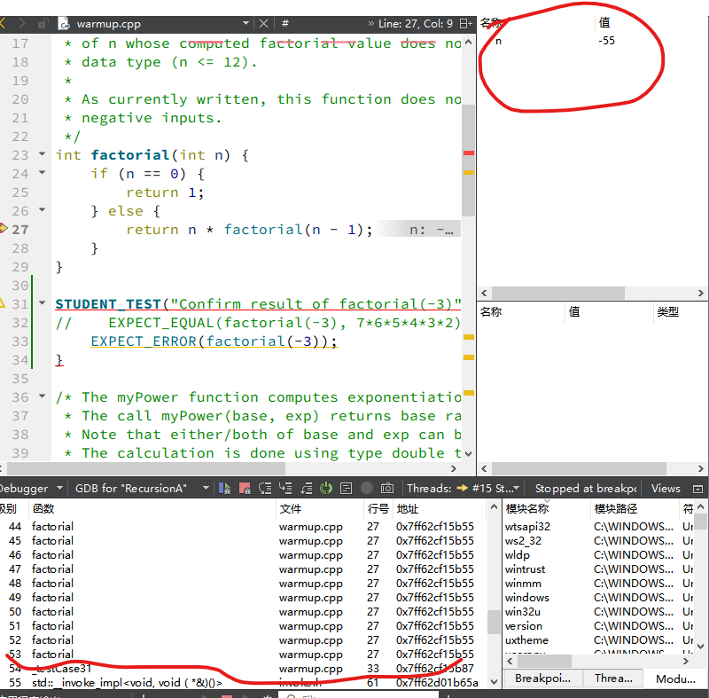
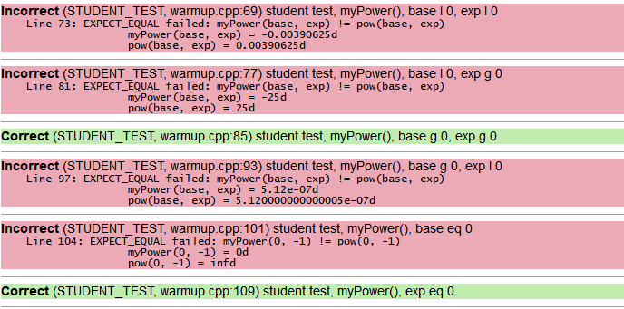
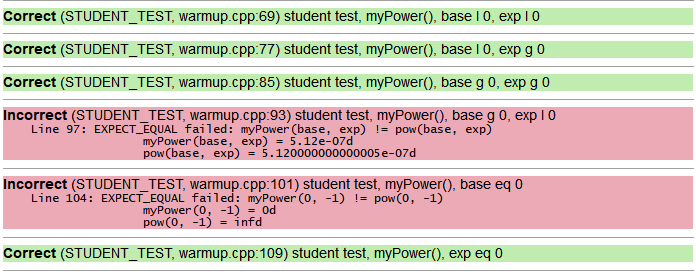
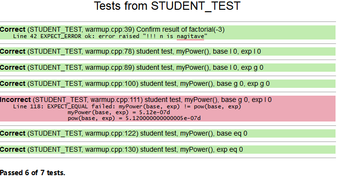
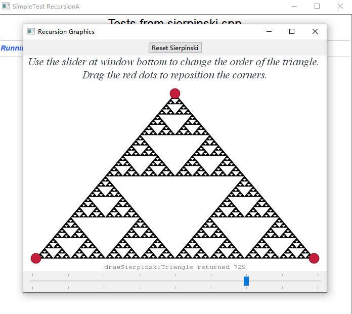
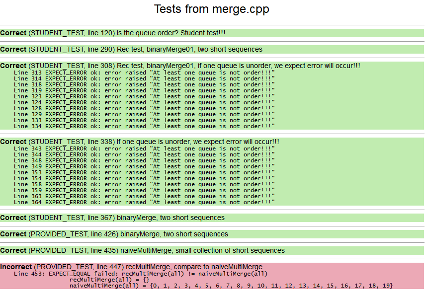
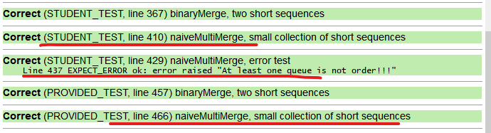
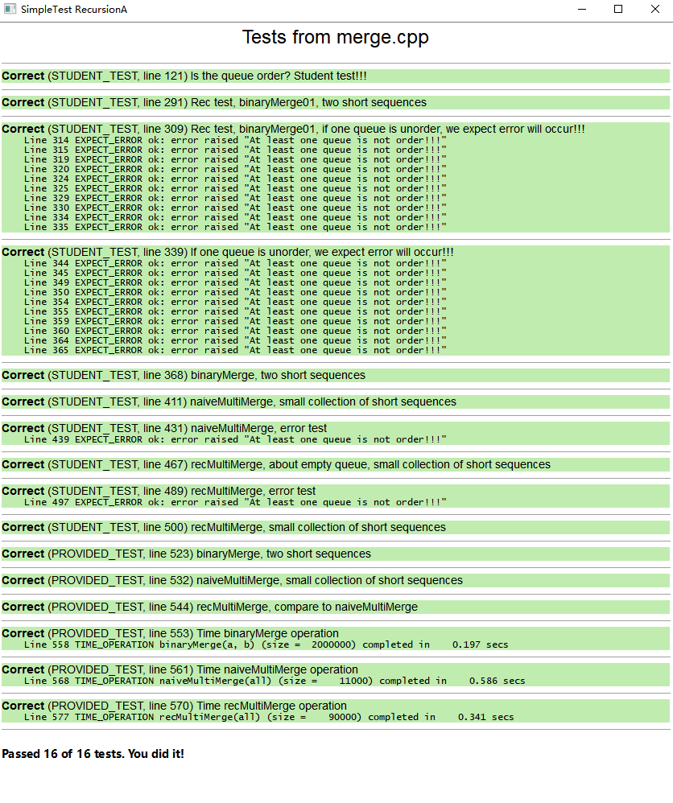

# 作业 3.1 递归基础

***********

## 第一部分 递归基础热身
对递归函数进行单元测试和调试。
### 检查递归栈帧（factorial）

在 Level 前面的黄色箭头表示当前选择的调用栈。在调试模式下，选中的函数调用栈，其代码会在代码编辑区显示，其内部变量会在变量面板区显示。

调用栈上的每一个活动函数在计算机内存中都有一个特定的位置来存储其参数和变量。该函数的存储区域，称为 “栈帧 Stack Frame”。

#### Q1. 在调试器中查看调用栈，什么可以表明正在调试的程序使用了递归？
+ **答案** 有多个函数名一样的调用栈，表明函数自己直接或者间接调用自己，使用了递归。

+ 测试 `EXPECT_ERROR(factorial(-3))`，程序直接终止，而且没有给出任何提示。
+ 对于栈溢出，每一个递归调用都会开辟新的内存空间以存放栈帧，最终整个栈空间被消耗殆尽，不给出错误。栈溢出导致程序崩溃。
+ <span style="color: red"> 在我的QT面板没有发现任何提示  </span>，但是通过调试发现了无穷多个调用


#### Q2. 从最外层减去最内层的数字，可以得到调用栈最大的栈帧数。你的系统调用栈中有多少个栈帧呢？
+ **答案** 一直单步调试，电脑死机了，没找着最多有多少栈帧。大于180个（在这时候死机的）。

#### Q3. 描述无限递归的症状与无限循环的症状有何不同。
```c++
int factorial(int n) {
    if (n == 0) {
        return 1;
    }
    //    add a error function
    else if(n<0){
        error("!!! n is nagitave");
    }
    else {
        return n * factorial(n - 1);
    }
}
```
**答案** 无限循环的函数不会异常退出，会一直运行下去。无限递归会造成栈溢出，导致电脑栈空间溢出，程序异常终止。

#### Q4. `base` 和 `exp` 导致测试失败的是什么情况？
+ **答案** 错误的情况有
  +  负数的负偶次幂
  +  负数的正偶次幂
  +  0 的负幂次

具体测试算例如下

+ 测试1 $base < 0, exp < 0$
    ！！！发现一个浮点误差问题。把报错的结果复制在下面：
    ```c++
    STUDENT_TEST("student test, myPower(), base l 0, exp l 0") {
        for (int base = -9; base < 0; base++) {
            for (int exp = -9; exp < 0; exp++) {
                cout <<"base = " << base << ", exp = "<< exp << endl;
                EXPECT_EQUAL(myPower(base, exp), pow(base, exp));
            }
        }
    } 
    ```
    ```c++
    base = -9, exp = -9
     =  Incorrect
        Line 69: EXPECT_EQUAL failed: myPower(base, exp) != pow(base, exp)
                        myPower(base, exp) = -2.581174791713197e-09d
                        pow(base, exp) = -2.581174791713196e-09d
    ``` 
    ```c++
    base = -5, exp = -5
     =  Incorrect
        Line 69: EXPECT_EQUAL failed: myPower(base, exp) != pow(base, exp)
                        myPower(base, exp) = -0.00032d
                        pow(base, exp) = -0.0003200000000000002d
    ```
    <span style="color: red"> 感觉前三个都是浮点误差造成的，结果其实是正确的。浮点误差应该不算吧？ </span>

    ```c++
    base = -4, exp = -4
     =  Incorrect
        Line 69: EXPECT_EQUAL failed: myPower(base, exp) != pow(base, exp)
                        myPower(base, exp) = -0.00390625d
                        pow(base, exp) = 0.00390625d
    ```
    这个是了，负数的负偶次幂

+ 测试2 $base < 0, exp > 0$

    ```c++
    STUDENT_TEST("student test, myPower(), base l 0, exp g 0") {
        for (int base = -5; base < 0; base++) {
            for (int exp = 1; exp < 10; exp++) {
                cout <<"base = " << base << ", exp = "<< exp << endl;
                EXPECT_EQUAL(myPower(base, exp), pow(base, exp));
            }
        }
    }
    ```
    报错为
    ```c++ 
    base = -5, exp = 2
     =  Incorrect
        Line 77: EXPECT_EQUAL failed: myPower(base, exp) != pow(base, exp)
                        myPower(base, exp) = -25d
                        pow(base, exp) = 25d
    ``` 
    这个是，负数的正偶次幂

+ 测试3 $base > 0, exp > 0$
    ```c++ 
    STUDENT_TEST("student test, myPower(), base g 0, exp g 0") {
        for (int base = 1; base < 10; base++) {
            for (int exp = 1; exp < 10; exp++) {
                cout <<"base = " << base << ", exp = "<< exp << endl;
                EXPECT_EQUAL(myPower(base, exp), pow(base, exp));
            }
        }
    }
    ``` 
    ```c++ 
    Correct (STUDENT_TEST, warmup.cpp:81) student test, myPower(), base g 0, exp g 0
    ``` 
    测试通过
    + 测试4 $base > 0, exp < 0$

    ```c++ 
    STUDENT_TEST("student test, myPower(), base g 0, exp l 0") {
        for (int base = 1; base < 10; base++) {
            for (int exp = -9; exp < 0; exp++) {
                cout <<"base = " << base << ", exp = "<< exp << endl;
                EXPECT_EQUAL(myPower(base, exp), pow(base, exp));
            }
        }
    }
    ```
    ```c++ 
    base = 5, exp = -9
     =  Incorrect
        Line 93: EXPECT_EQUAL failed: myPower(base, exp) != pow(base, exp)
                        myPower(base, exp) = 5.12e-07d
                        pow(base, exp) = 5.120000000000005e-07d
    ``` 
    <span style="color: red"> 浮点误差应该不算吧？ </span> 这个测试应该算通过了。

+ 测试5 $base = 0$
    ```c++
    STUDENT_TEST("student test, myPower(), base eq 0") {
        EXPECT_EQUAL(myPower(0, 1), pow(0, 1));
        EXPECT_EQUAL(myPower(0, -2), pow(0, -2));
        EXPECT_EQUAL(myPower(0, 0), pow(0, 0));
    }
    ```
    ```c++ 
    Incorrect (STUDENT_TEST, warmup.cpp:97) student test, myPower(), base eq 0
        Line 99: EXPECT_EQUAL failed: myPower(0, -2) != pow(0, -2)
                        myPower(0, -2) = 0d
                        pow(0, -2) = infd
    ``` 
    ```

        Line 100: EXPECT_EQUAL failed: myPower(0, 1) != pow(0, -1)
                        myPower(0, 1) = 0d
                        pow(0, -1) = infd
    ```
    $0$ 的负幂次，测试不通过
+ 测试6 $exp=0$
    ```c++ 
    STUDENT_TEST("student test, myPower(),  exp eq 0") {
        EXPECT_EQUAL(myPower(1, 0), pow(1, 0));
        EXPECT_EQUAL(myPower(-5, 0), pow(-5, 0));
        EXPECT_EQUAL(myPower(0, 0), pow(0, 0));
    }
    ```
    测试通过 

##### 调试一个递归函数
- 好的设计要避免不必要的重叠或冗余的情况。
- 增加额外的用例不仅浪费资源，
- 而且在代码风格上很差，
- 更糟糕的是，它还可能引入错误。

#### Q5. 在现有的五种情况下，是否有一些是重叠或多余的？你认为哪些是绝对必要的？有哪些 case 是你不确定的吗？

+ **答案**
  - 指数为零的都返回1，这个必须要有。
  - 指数小于0，这个要变乘法为除法，必须要有。
  - 基数小于0，这个不一定需要。如果要了，可能要有很繁琐的判断，乘幂算法本来就是基数连乘，负负得正这些法则，乘法本来就包含。
  - 基数等于零，这个不充分。如果是零的负指数，那结果就是无穷大。<span style="color: red">而且，这个必须在前面判断，以免让指数小于零把0的负指数包含进去，那样结果也可能会有问题。或者就明显分开，`base == 0 && exp < 0` 和 `base != 0 && exp < 0` </span>

+ 注释掉 `base < 0` 之前



+ 先注释掉 `base < 0` 的case，结果确实变好了



+ 修改后的代码（删除了 `base==0` case，<span style="color: blue"> 并加入 $base=0$， 且 $exp<0$ 结果为无穷大 </span> 的情况。）
   ```c++
   double myPower(int base, int exp)
   {
       if (exp == 0)
       { // handle zero exp
           return 1;
       }
       else if (base == 0 && exp < 0)
       { // handle zero base
           return 1. / 0.;
       }
       else if (exp < 0)
       { // handle negative exp
           return 1.0 / myPower(base, -exp);
       }
       else
       { // both base and exp are positive
           return base * myPower(base, exp - 1);
       }
   }
   ```
   结果截图为
   
   - <span style="color: red"> 其实这个算例，如果格式化一下，忽略浮点误差，可能会更好。</span> 比如在第五个student test里面，把结果保存为有效位数的值，就能通过。但是我没找到格式化保存的函数，只找到用stream格式化输出的函数。有类似方法吗？
   -  我原本以为把简单的判断相等 $a=b$，换成相减并取绝对值小于一个小量 $abs(a-b)<1e-20$，就可以解决问题，如
        ```c++
        EXPECT_EQUAL(myPower(0, 2), pow(0, 2));
        ```
        换成
        ```c++
        EXPECT_EQUAL(fabs(myPower(0, 2) - pow(0, 2)) <  1e-12, 1);
        ```
        但是这个方法，对于0的负指数，结果应该为 $inf$，两个 $inf$ 相减，结果并不为一个小量，还是不行。这种情况还是得用判断相等，两个 $inf$ 在c++ 判断里面是相等的。

***********
## 第二部分 符号配对
+ `operatorsFrom` 函数的实现以及测试代码如下
  
   ```c++
    string operatorsFrom(string str)
    {
        /* TODO: Implement this function. */
        string setParenthesis = "{}[]()";

        string result;
        if (str.empty())
        {
            return result += "";
        }
        else
        {
            if (setParenthesis.find(str.at(0)) != std::string::npos)
            {
                result += str.at(0);
            }

            return result += operatorsFrom(str.substr(1));
        }
    }

    STUDENT_TEST("operatorsFrom on simple example")
    {
        EXPECT_EQUAL(operatorsFrom("vec[3]"), "[]");
        EXPECT_EQUAL(operatorsFrom("   423212(asfaf)   {3213fadfa}32131{222}213{}vec[3]"), "(){}{}{}   []");
        EXPECT_EQUAL(operatorsFrom("vec({[3]"), "({[]   ");
        EXPECT_EQUAL(operatorsFrom("int main() { int    x = 2 * (vec[2] + 3); x = (1 + random()); }   "), "(){([])(())}");
    }
   ```

+ ! 注意
    - 两个函数都必须递归操作，不应该使用任何循环
    - 不应该使用任何辅助 ADT（不要使用 Stack、Queue、Vector 等）来存储或构建中间结果

+ `operatorsAreMatched` 函数的实现以及测试代码如下
  ```c++
    void operatorsAreMatchedRec(string &opsRec, string ops){
        if(ops.empty()){
            ;
        }
        // 如果有满足配对的括号，那么在寻找过程中，
        // 总能找到两个相连的成对括号，
        // 消去相连的一对括号，再寻找
        else{
            opsRec += ops.at(0);
            int opsRecSize = opsRec.size();
            if(opsRecSize>1){
                string opsRecSizeEnd2 = opsRec.substr(opsRecSize-2);
                // 如果满足配对就消去
                if(opsRecSizeEnd2 == "{}"
                    || opsRecSizeEnd2 == "[]"
                    || opsRecSizeEnd2 == "()")
                {
                    // 找到相连的一对就消去
                    opsRec = opsRec.substr(0,opsRecSize-2);
                }
            }
            // 再递归寻找 ops 排除第一个元素的子集
            operatorsAreMatchedRec(opsRec, ops.substr(1));
        }
    }
    bool operatorsAreMatched(string ops)
    {
        /* TODO: Implement this function. */
        bool result;
        string opsRec="";
        operatorsAreMatchedRec(opsRec,  ops);

        if (opsRec.empty()){
            result = true;
        }else{
            result = false;
        }
        return result;
    }
    ```

#### Q6. 将你的递归解决方案与下面的 `checkBalance` 迭代方法进行比较。你觉得哪个版本更容易阅读和理解？哪个版本更容易确认正确的行为？
**答案** 
   + 我起初觉得递归很难，但是看了这个循环，我还是觉得递归更好。
   + 这种情况递归更容易产生正确行为。`checkBalance` 函数回返回不同的整型值，而递归只返回我们要的结果：True or False。

-----------------
## 第三部分 Sierpinski 分形

+ Order-1 阶 Sierpinski 三角形 由 Order-0 阶的三个较小副本组成

+ `drawSierpinskiTriangle` 函数为
   ```c++
    int drawSierpinskiTriangle(GWindow & window, GPoint one, GPoint two,    GPoint three, int order)
    {
        /* TODO: Implement this function. */
        int result = 0;
        if (order == 0)
        {
            fillBlackTriangle(window, one, two, three);
            return 1;
        }
        else
        {
            GPoint twoHalf((one.x + two.x) / 2, (one.y + two.y) / 2);
            GPoint threeHalf((one.x + three.x) / 2, (one.y + three.y) / 2);
            GPoint oneHalf((three.x + two.x) / 2, (three.y + two.y) / 2);
            result += drawSierpinskiTriangle(window, one, twoHalf, threeHalf, order - 1);
            result += drawSierpinskiTriangle(window, two, oneHalf, twoHalf, order - 1);
            result += drawSierpinskiTriangle(window, three, oneHalf, threeHalf, order - 1);
        }
        return result;
    }
   ```
   如果要让我挨个理解每一个递归调用函数的结果，我大概率会晕。虽然没法具体解释每一次调用的具体结果，但是利用简单的 1 阶三角形（答案为3），把这个函数写出来，后面的高阶结果也就通过了。
### 测试图形


------------------------
## 第四部分 合并有序序列
实现一个高效的分治算法来合并有序序列。

### 二路归并
+ 二路归并（binary search）是计算机科学中非常普遍的操作，
+ 将两个独立的有序序列合并成一个更大的有序序列。
+ 归并是许多不同排序任务的核心任务，这使得此操作在大量应用程序中非常有用。
### 实现二路归并函数
+ 技术要求
  - 从小到大排序
  - 函数传值
  - 不对Queue的长度做要求
  - 重复值不需要特殊处理
  - 整洁而紧凑，考虑将任务分解为两个子任务——确定下一个要处理的元素，然后处理它
  - 必须使用迭代而不是递归
+ **二路归并函数实现 01，运行时判断有序性**
   ```c++
   Queue<int> binaryMerge(Queue<int> a, Queue<int> b)
   {
       Queue<int> result;
       /* TODO: Implement this function. */
       // 由于 a, b 的长度会变，提前把它们的长度保存
       int lenA = a.size();
       int lenB = b.size();
       // 如果 b 为空，则返回a
       if (lenB == 0)
       {
           // 加这个循环是为了判断a是否有序
           for(int i = 0; i < lenA; ++i){
               int varA = a.dequeue();
               if (!a.isEmpty() && varA > a.peek())
               {
                   error("At least one queue is not order!!!");
               }
               result.enqueue(varA);
           }
       }
       else
       {
           // 定义 b 的元素，先取出一个，索引起始就变成1
           int indexB = 1;
           int varB = b.dequeue();
           // 遍历 a，并排序在 a 的长度内有关的 b 的元素
           for (int i = 0; i < lenA; ++i)
           {
               int varA = a.dequeue();
               // 判断a是否有序
               if (!a.isEmpty() && varA > a.peek())
               {
                   error("At least one queue is not order!!!");
               }
               // 如果 varB 不大于 varA，就先遍历部分 b
               while (varA >= varB && indexB < lenB)
               {
                   result.enqueue(varB);
                   // 这个分支我们可以确保b至少有一个元素
                   if (varB > b.peek())
                   {
                       error("At least one queue is not order!!!");
                   }
                   varB = b.dequeue();
                   indexB += 1;
               }
               // 由于 while 循环取出的 b 的最后一个元素没有加入result，
               // 额外加一个判断，
               // 为了保证索引 indexB正确，还是要加一个 indexB + =1 操作
               // 这个分支用来处理 b 的最后一个元素
               if (varA >= varB && indexB == lenB)
               {
                   result.enqueue(varB);
                   indexB += 1;
               }
               // 如果 varB 大于 varA，就把 varA 加入 result
               result.enqueue(varA);
           }
           // 最后，如果 b 还剩下元素，
           // 由于此时剩下的元素都是更大的
           // 只需要再把剩下的元素加入 result
           for (int i = indexB - 1; i < lenB; ++i)
           {
               result.enqueue(varB);
               if (!b.isEmpty())
               {
                   if (varB <= b.peek())
                   {
                       varB = b.dequeue();
                   }
                   else
                   {
                       error("At least one queue is not order!!!");
                   }
               }
           }
       }
       return result;
   }  
   ```
+ **二路归并函数实现 02，加一个函数判断有序性**
    ```c++
    bool isOrder(Queue<int> a)
    {
        int lenA = a.size();
        for (int i = 0; i < lenA; i++)
        {
            int thisOne = a.dequeue();
            if (!a.isEmpty())
            {
                int nextOne = a.peek();
                if (thisOne > nextOne)
                {
                    return false;
                }
            }
        }
        return true;
    }

    Queue<int> binaryMerge(Queue<int> a, Queue<int> b)
    {
        Queue<int> result;
        /* TODO: Implement this function. */
        // 先判断输入是否是排序好的队列
        if (!(isOrder(a) && isOrder(b)))
        {
            error("At least one queue is not order!!!");
        }
        // 由于 a, b 的长度会变，提前把它们的长度保存
        int lenA = a.size();
        int lenB = b.size();
        // 如果 b 为空，则返回a
        if (lenB == 0)
        {
            result = a;
        }
        else
        {
            // 定义 b 的元素，先取出一个，索引起始就变成1
            int indexB = 1;
            int varB = b.dequeue();
            // 遍历 a，并排序在 a 的长度内有关的 b 的元素
            for (int i = 0; i < lenA; ++i)
            {
                int varA = a.dequeue();
                // 如果 varB 不大于 varA，就先遍历部分 b
                while (varA >= varB && indexB < lenB)
                {
                    result.enqueue(varB);
                    varB = b.dequeue();
                    indexB += 1;
                }
                // 由于 while 循环取出的 b 的最后一个元素没有加入result，
                // 额外加一个判断，
                // 为了保证索引 indexB正确，还是要加一个 indexB + =1 操作
                if (varA >= varB && indexB == lenB)
                {
                    result.enqueue(varB);
                    indexB += 1;
                }
                // 如果 varB 大于 varA，就把 varA 加入 result
                result.enqueue(varA);
            }
            // 最后，如果 b 还剩下元素，
            // 由于此时剩下的元素都是更大的
            // 只需要再把剩下的元素加入 result
            for (int i = indexB - 1; i < lenB; ++i)
            {
                result.enqueue(varB);
                if (!b.isEmpty())
                {
                    varB = b.dequeue();
                }
            }
        }
        return result;
    }
    ```
+ **二路归并函数实现 03，递归实现，运行时判断有序性**
    ```c++
    void binaryMergeRec(Queue<int> a, Queue<int> b, Queue<int> &result)
    {
        //    Queue<int> result;
        /* TODO: Implement this function. */
        // 最简单的情况: a, b 都为空
        if (b.isEmpty() && a.isEmpty())
        {
        }
        else
        {
            // 经过上一个判断，a,b 至少有一个不为空
            // 如果 b 为空，那么只需要处理 a if (b.isEmpty())
            if (b.isEmpty())
            {
                // 弹出 a 的队列首元素
                int varA = a.dequeue();
                // 这里判断 a 是不是有序数列，
                // 如果经过上一次弹出操作，a还不为空
                if (!a.isEmpty())
                {
                    // 比较当前弹出值与下一个元素
                    // 如果弹出值比下一个还大，那么报错
                    if (varA > a.peek())
                    {
                        error("At least one queue is not order!!!");
                    }
                }
                // 如果前面的判断没有报错，就在结果加上当前值
                result.enqueue(varA);
            }
            else if (a.isEmpty())
            {
                // 同 b 为空的分支
                int varB = b.dequeue();
                if (!b.isEmpty())
                {
                    if (varB > b.peek())
                    {
                        error("At least one queue is not order!!!");
                    }
                }
                result.enqueue(varB);
            }
            else
            {
                // 如果 a, b 都不为空
                // 先比较a,b队列首元素，不弹出
                int varA = a.peek();
                int varB = b.peek();
                // 谁的首元素小，就弹出谁的首元素
                int resultIn = (varA >= varB ? b.dequeue() : a.dequeue());
                // 这个时候需要判断数列的有序性，
                // 由于刚才没有显式说明弹出了谁的元素，现在需要知道是谁被弹出了
                // 为了减少复制开销，构造一个指针变量，指向被弹出队列的地址
                Queue<int> *arrOut = &(varA >= varB ? b : a);

                // 判断被弹出元素队列的有序性
                if (!arrOut->isEmpty())
                {
                    // 这里只读取值，不弹出，确保指针不会改变变量
                    if (resultIn > arrOut->peek())
                    {
                        error("At least one queue is not order!!!");
                    }
                }
                // 上面过程无误，result 加入新元素
                result.enqueue(resultIn);
            }
            // 进入下一次递归
            binaryMergeRec(a, b, result);
        }
    }
    // 二元归并递归实现版本
    Queue<int> binaryMerge01(Queue<int> a, Queue<int> b)
    {
        Queue<int> result;
        // 用引用将每一个结果保存进 result，需要再写一个接口递归函数
        binaryMergeRec(a, b, result);
        return result;
    }
    ```
#### Q7. 假设采用递归实现，粗略估计一下你的系统可以成功合并的最大序列。
**答案** 现在不会做。
<!-- 我的思路是：
+ 先得到一个递归函数占据多大内存？包括存储函数地址，函数里面所有的变量占据内存。
+ 需要知道栈空间是多大。
+ 最大序列大约就是 栈空间/ -->
+ 这一题，利用上面三种思路，实现的函数都通过了测试，包括自己写的和原有的
  
#### Q8. 如果试图递归合并一个大于最大值的序列，将会发生什么行为？
**答案** 发生栈溢出，报错或死机？

### 分析二路归并
先列出复杂度
```c++
dequeue() 	    O(1)
enqueue(value) 	O(1)
isEmpty() 	    O(1)
peek() 	        O(1)
size() 	        O(1)
```
二路归并函数所用的方法，复杂度都是 $o(1)$，那么：
假设 a， b 分别有 N_a 和 N_b 个元素，那么最坏的结果就是 a，b 都是有序的，需要挨个判断，总共循环 $N_a + N_b$ 次，，如果判断的开销是 1 ，还要判断 $N_a -1 + N_b-1$。复杂度就是  $o((N_a + N_b))$。

#### 测试并分析 naiveMultiMerge 函数
+ 添加的测试算例为：
    ```c++
    STUDENT_TEST("naiveMultiMerge, small collection of short sequences")
    {
        Vector<Queue<int>> all = {{},
                                  {},
                                  {},
                                  {},
                                  {-5},
                                  {3402}};
        Queue<int> expected = {-5,  3402};
        EXPECT_EQUAL(naiveMultiMerge(all), expected);
        all = {{},
                {},
                {},
                {},
                {},
               };
        expected = {};
        EXPECT_EQUAL(naiveMultiMerge(all), expected);
    }
    STUDENT_TEST("naiveMultiMerge, error test")
    {
        Vector<Queue<int>> all = {{},
                                  {},
                                  {2,2,2,2,2},
                                  {},
                                  {-5,-6},
                                  {3402,32323}};
        EXPECT_ERROR(naiveMultiMerge(all));

    }
    ```
    测试通过截图
    

### 递归多路归并
#### 递归实现多路归并
+ 递归实现代码如下
    ```c++
    Queue<int> recMultiMerge(Vector<Queue<int>> &all)
    {
        Queue<int> result;
        /* TODO: Implement this function. */
        int sizeOfAll = all.size();
        if (sizeOfAll == 1)
        {
            return binaryMerge(all.get(0), result);
        }
        else
        {
            int halfSize = sizeOfAll / 2;
            auto left = all.subList(0, halfSize);
            auto right = all.subList(halfSize, sizeOfAll - halfSize);
            Queue<int> res1 = recMultiMerge(left);
            Queue<int> res2 = recMultiMerge(right);
            result = binaryMerge(res1, res2);
        }
        return result;
    }
    ```
+ 添加三个测试
    ```c++
    STUDENT_TEST("recMultiMerge, about empty queue, small collection of short sequences")
    {
        Vector<Queue<int>> all = {{},
                                  {},
                                  {},
                                  {},
                                  {-5},
                                  {3402}};
        Queue<int> expected = {-5, 3402};
        EXPECT_EQUAL(recMultiMerge(all), expected);
        all = {
            {},
            {},
            {},
            {},
            {},
        };
        expected = {};
        EXPECT_EQUAL(recMultiMerge(all), expected);
        EXPECT_EQUAL(recMultiMerge(all), naiveMultiMerge(all));
        all = {
               {},
               };
        expected = {};
        EXPECT_EQUAL(recMultiMerge(all), expected);
        EXPECT_EQUAL(recMultiMerge(all), naiveMultiMerge(all));
        all = {
               {5,6,7},
               };
        expected = {5,6,7};
        EXPECT_EQUAL(recMultiMerge(all), expected);
        EXPECT_EQUAL(recMultiMerge(all), naiveMultiMerge(all));
    }

    STUDENT_TEST("recMultiMerge, error test")
    {
        Vector<Queue<int>> all = {{},
                                  {},
                                  {2, 2, 2, 2, 2},
                                  {},
                                  {-5, -6},
                                  {3402, 32323}};
        EXPECT_ERROR(recMultiMerge(all));
    }

    STUDENT_TEST("recMultiMerge, small collection of short sequences")
    {
        Vector<Queue<int>> all = {{3, 6, 9, 9, 100},
                                  {1, 5, 9, 9, 12},
                                  {5},
                                  {},
                                  {-5, -5},
                                  {3402}};
        Queue<int> expected = {-5, -5, 1, 3, 5, 5, 6, 9, 9, 9, 9, 12, 100, 3402};
        EXPECT_EQUAL(recMultiMerge(all), expected);
    }
    ```

+ 运行截图
  

### 搜索结果归并排序 
？？？
没有翻译，还没做。等我再研究学习一下 BFS 算法。