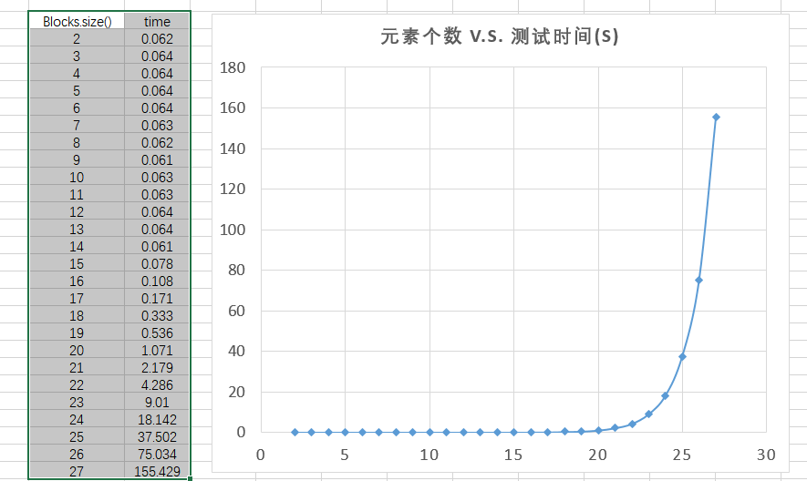
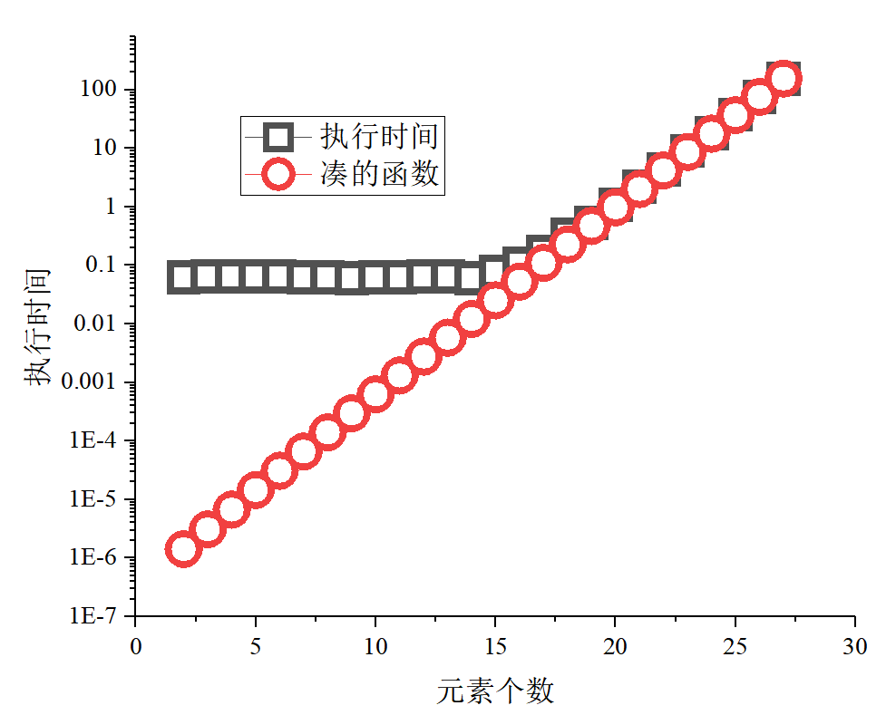
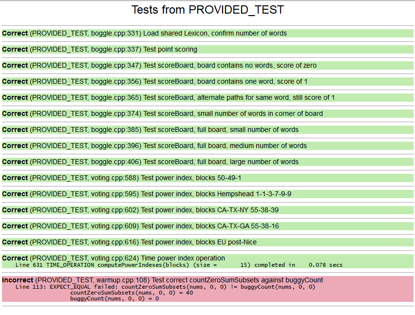

# 作业 3.2 递归回溯

## 目标
+ 通过将问题划分为一个或者多个 Base Case 和 Recursive Case 来开发递归算法。
+ 利用 **递归回溯** 技术，解决迭代方法无法轻松解决的问题。
+ 实现 **更高级的递归算法**，解决迭代方法无法轻松解决的问题。

--------------------------

## 第一部分 递归回溯热身
### 汉诺塔动画
汉诺塔作为一个经典的谜题，它有一个美丽的递归解。在这个调试器练习中，我们将研究这个问题的一个版本，该版本还计算解决这个难题需要多少步。
#### Q16. 在 hanoiAnimation 中越过（step over） moveTower 调用之后，talMoves 的值是什么？
**答案** 15

#### Q17. 在 Step Over 第一个递归子调用之后，totalMoves 变量的值是什么？（换句话说，在 else 语句中，只要 Step Over 第一个递归子调用 moveTower就可以执行 moveTower)
**答案** 第一个子调用之后，`totalMoves` 还是 0。


#### Q18. 在 moveTower 的 Base Case 满足时选择 Step Out，你最终会在哪里结束？（你在哪个函数中，行号是多少？）此时，totalMoves 变量的值是多少？
**答案** 在 `moveTower` 函数第一行。`totalMoves` 变量值仍然是 0。

+ Step In 可以让你看到每个时间点上发生了什么。 
  <span style="color: red"> **整体观**思考递归调用。递归调用是一个完整的“黑盒”，它会处理所有子问题。  </span>
+ Step Over 让你看到递归函数的整体功能。
  <span style="color: red">**从外部递归调用，移动到内部递归调用**，并跟踪实际的递归调用细节。</span>
+ Step Out 允许你执行完当前函数，并查看代码的整体行为。
  <span style="color: red">**从内部递归调用，回到外部递归调用。</span>

### 测试并调试错误的子集求和问题
决策树中的每个节点，根据是否包含一个待考虑的元素，将其分为 两个递归调用
+ 一个包含该元素，
+ 另一个排除该元素。
+ 决策树会生长到 N 的深度，其中 N 是集合中的元素总数。

##### `buggyCount` 的bug在哪里？

+ **答案** 首先对比两个实现的不同：
    ```c++
    return countZeroSumSubsets(v, index + 1, sumSoFar + v[index]) +     countZeroSumSubsets(v, index + 1, sumSoFar);
    ```
    ```c++
    return buggyCount(v, index + 1, sumSoFar += v[index]) + buggyCount(v,   index + 1, sumSoFar);
    ```
+ **区别在于** `+` 操作与 `+=` 操作。`+=` 操作会把两数累加并存在前面的数里面，而纯 `+` 操作只是生成一个临时累加变量。

+ **问题出在** 违反了一个递归有两个子情况的时候，不能改变中间变量的原则。在这里，`buggyCount` 函数实现中，`sumSoFar` 被改变了。

#### Q19. 你用来触发程序错误的最小可能输入是什么？
**答案**
  + **设计测试** 设计一个**只有一个元素**的集合，就能找到错误
    ```c++
    STUDENT_TEST("Test buggyCount, 1 number") {
        Vector<int> nums = {4};
        EXPECT_EQUAL(countZeroSumSubsets(nums, 0, 0), 1);
        EXPECT_EQUAL(buggyCount(nums, 0, 0),1);
    }
    ```

#### Q20. 识别代码中的单字符错误，并解释为什么单字符错误会导致上述测试案例中的错误返回结果。你应该能够具体说明错误是如何导致结果从“完全正确”变为“严重错误”的。
**答案** `+` 操作与 `+=` 。
+ `+` 不会改变两个操作数的值，只会产生一个新的结果，在这个函数中就是一个匿名临时变量。
+ `+=` 会改变前面的操作数值，导致**违反了一个递归有多个子情况分支的时候，不能改变中间变量**的原则。


<span style="color: red"> 找到一个最小可重复性的测试案例，对于调试任何类型的代码来说都是一种有效的策略。  </span>

--------------------------

## 第二部分 拼字游戏

+ **该游戏核心的递归问题是：** 找到拼字盘上所有单词并达到尽可能高的分数。
+ 如果一个单词满足以下所有条件，则该词对给定的游戏板有效：
    - 单词必须至少有 4 个字母。
    - 单词必须包含在有效的英语单词列表中。
    - 单词可以通过跟踪相邻的字母立方体路径来形成，最多使用一次立方体。
    - 单词不能重复记分，每个单词只记分一次。
    - 一个 4 个字母的单词获得 1 分；一个 5 个字母的单词获得 2 分；6 个字母的单词获得 3 分；以此类推。
+ **任务：** 编写一个函数，计算给定 Boggle 板上所有单词的总分数。
  + **回溯：** 从 16 个字母立方体中的每个立方体开始进行搜索，递归探索从起点开始的所有路径，并跟踪其相邻立方体
  + **标记：** “标记”是否访问过字母立方体

#### 记录函数编写过程
+ **思路：**
  + 遍历每一个格点的字母，以此为起点，搜索可能的单词。假设为4x4的格子，那么一共要遍历16次。
  + 单个循环用递归实现
  + 实现过程中注意单个循环的时间开销

+ **程序实现：**
  + **打分程序：** 简单，字符串长度减三
    ```c++
    int points(string str)
    {
        /* TODO: Implement this function. */
        //    int lengthStr = str.size();
        return (str.size() - 3);
    }
    ```
  + **辅助函数：** 判断单词是否包含在字典里面
    ```c++
    // 判断单词是否包含在字典里面
    bool wordInLexicon(const string &thisWord, Lexicon &lex)
    {
        return lex.contains(thisWord);
    }
    ```
  + **辅助函数：** 像迷宫案例一样，寻找可能的邻域
    ```c++
    Set<GridLocation> neiborBoard(Grid<char> &board, GridLocation thisLoc)
    {
        Set<GridLocation> neighbors;
        /* TODO: Fill in the remainder of this function. */
        int thisRow = thisLoc.row;
        int thisCol = thisLoc.col;

        GridLocation north(thisRow + 0, thisCol + 1);
        GridLocation south(thisRow + 0, thisCol - 1);
        GridLocation east(thisRow + 1, thisCol + 0);
        GridLocation west(thisRow - 1, thisCol + 0);
        GridLocation northEast(thisRow + 1, thisCol + 1);
        GridLocation northWest(thisRow - 1, thisCol + 1);
        GridLocation southEast(thisRow + 1, thisCol - 1);
        GridLocation southWest(thisRow - 1, thisCol - 1);

        if (board.inBounds(north) && isalpha(board[north])) // 是否在board内？是否是字符
        {
            neighbors.add(north);
        }
        if (board.inBounds(south) && isalpha(board[south])) // 是否在board内？是否是字符
        {
            neighbors.add(south);
        }
        if (board.inBounds(east) && isalpha(board[east])) // 是否在board内？是否是字符
        {
            neighbors.add(east);
        }
        if (board.inBounds(west) && isalpha(board[west])) // 是否在board内？是否是字符
        {
            neighbors.add(west);
        }
        if (board.inBounds(northEast) && isalpha(board[northEast])) // 是否在board内？是否是字符
        {
            neighbors.add(northEast);
        }
        if (board.inBounds(northWest) && isalpha(board[northWest])) // 是否在board内？是否是字符
        {
            neighbors.add(northWest);
        }
        if (board.inBounds(southEast) && isalpha(board[southEast])) // 是否在board内？是否是字符
        {
            neighbors.add(southEast);
        }
        if (board.inBounds(southWest) && isalpha(board[southWest])) // 是否在board内？是否是字符
        {
            neighbors.add(southWest);
        }
        return neighbors;
    }
    ```
  + **先遍历 board 上的所有元素**
    ```c++
    int scoreBoardIter(Grid<char> &board, Lexicon &lex)
    {
        Set<string> words0;
        int socres = 0;
        for (int i = 0; i < board.size(); ++i)
        {
            // 位置索引
            int row = int(i / board.numRows());
            int col = int(i % board.numRows());
            GridLocation input = {row, col};
            // 设置起点
            Set<GridLocation> neighbors = neiborBoard(board, input);
            // 每一次都从零开始记录 经过路径，路径首先要加上起点
            Set<GridLocation> passLoc;
            passLoc.add(input);
            // *********** 开始单个循环
            // 单词记录，分数叠加
            string word;
            word.push_back(board[input]);
            scoreBoardOneRoad(board, sharedLexicon(), neighbors, words0, socres, passLoc, word);
        }
        return socres;
    }
    ```
  + **递归实现每个循环的搜索**
    ```c++
    void scoreBoardOneRoad(Grid<char> &board,
                           Lexicon &lex,
                           Set<GridLocation> &neighbors,
                           Set<string> &words,
                           int &socres,
                           Set<GridLocation> &passLoc,
                           string &thisWord)
    {

        // 如果邻域为空，设置为递归终止条件
        if (neighbors.isEmpty())
        {
            if (wordInLexicon(thisWord, lex) && thisWord.size() > 3)
            {
                if (!words.contains(thisWord))
                {
                    socres += points(thisWord);
                    words.add(thisWord);
                }
            }
        }
        else
        {
            // 下一个邻域
            Set<GridLocation> neighborsNext;
            // 人为设置下一个邻域为空集
            Set<GridLocation> neighborsEmpty = {};
            // 遍历邻域
            for (const auto &item : neighbors)
            {
                // 先确保这一条路径没有被走过
                if (!passLoc.contains(item))
                {
                    // 把位置加入已走过的路径
                    passLoc.add(item);
                    // 这个位置的邻域
                    neighborsNext = neiborBoard(board, item);
                    // 为了防止无效搜索，先看看前几个字母有没有可能的对应单词
                    if (lex.containsPrefix(thisWord))
                    {
                        // 包含这个邻居的情况，且要继续向下搜索
                        thisWord.push_back(board[item]);
                        scoreBoardOneRoad(board, lex, neighborsNext, words, socres, passLoc, thisWord);
                        // 包含这个邻居，且搜索到此为止的情况，下一个邻域变为 空集
                        scoreBoardOneRoad(board, lex, neighborsEmpty, words, socres, passLoc, thisWord);
                        thisWord.pop_back();
                        // 不包含这个邻居，且搜索到此为止的情况，下一个邻域变为 空集
                        // 不包含这个邻居且搜索到此为止的情况,
                        // 这句可以不要，因为是set，会去重
                        // scoreBoardOneRoad(board, lex, neighborsEmpty, words, socres, passLoc, thisWord);
                    }
                    // 本轮递归结束，要把 已走过路径变为原来的情况，因为遍历过程，每次都要保证初始条件相同
                    passLoc.remove(item);
                }
            }
        }
    }
    ```
--------------------------
## 第三部分 投票系统

+ 在美国系统中，每个州是一个区块，根据其人口规模有特定数量的选票
+ 州内的选举决定了该区块作为一个整体投票的方向
+ 衡量一个区块的重要性或投票“权力”的一个指标是在选举结果中，该区块符合我们所说的“关键选票”的次数。
+ **关键选票** 对于一个给定的投票区块 B，如果没有 B 就会输掉选举；如果有 B 就会赢得选举，那么 B 称为关键选票。也就是说，B 能够左右选举的结果。
+ Banzhaf 影响力指数用于表示一个区块的投票权重，即该区块在所有关键选票总数中所占的百分比。

#### 注意事项
+ 平局。为了赢得选举，联盟必须获得严格的多数选票，平局不被视为获胜的联盟。
- 舍入。我们将影响力指数计算为一个整数，这是一个舍入的值（确切地说，小数部分会被截掉）。所以最终的影响力指数总和可能是 99 而不是 100。
- 递归思路。可以参考类似子集探索的经典包含/排除模式的代码。
+ 效率。尝试所有子集的穷举递归，在计算上是非常耗时的。
  - 一旦发现无论目标区块是否参与，联盟都将获胜，就没有必要进一步探索这条道路。目标区块不可能成为这个联盟中的关键选票。
  - 在使用 ADT 时要深思熟虑，并注意避免不必要的复制操作（ADT 作为参数传值或从函数返回时，都将产生复制操作）。
  - 此外，不要试图首先构建所有联盟的子集，然后再处理联盟。考虑到一个投票系统，即使只有少量的块，仍然会消耗大量的内存。相反，你必须一次探索一个联盟：先组建出一个联盟，测试它，取消选择并回溯，然后再组建另一个联盟，不断地探索。在任何时候，只有一个组建好的联盟会存放在内存中。

#### 函数实现
+ 递归函数，用于获得每个区块作为关键区块的次数
    ```c++
    /** \param blocks      原始的所有区块联盟
     *  \param tempSubset  栈，当前的临时子集
     *  \param index       当前决策树到达的索引
     *  \param sumBlocks   总共有多少积分
     *  \param sumSubset   现在这个联盟有多少积分
     *  \param powerIndex  栈，记录子集里面的元素在 blocks 里面的位置索引，用于计数
     *  \param result      向量，记录每个目标区块成为关键区块的次数
     */
    void computePowerIndexesRec(const Vector<int> &blocks,
                                Stack<int> &tempSubset,
                                int index,
                                const int sumBlocks,
                                int sumSubset,
                                Stack<int> &powerIndex,
                                Vector<int> &result)
    {
        // 每一个决策树分支都遍历 blocks.size() 次
        // 不管最后有几个元素，只要遍历次数够了，到达决策树末端，就加入子集的集合
        if (index == blocks.size())
        {
            Stack<int> powerIndex01 = powerIndex;
            const int powerIndexSize = powerIndex.size();
            for (int i = 0; i < powerIndexSize; ++i)
            {
                // 有这个区块，获胜或平均，
                // 且 没有这个区块，必输
                int item = powerIndex01.pop();
                if (sumSubset > sumBlocks / 2 && (sumSubset - blocks[item]) <= sumBlocks / 2)
                {
                    result[item]++;
                }
            }
        }
        else
        {
            if (sumSubset <= sumBlocks / 2)
            {
                // -------------------------------------------------------
                // 递归过程不能改变中间变量值
                // 如果积分票数不大于一半的总票数，当前选票可能会是关键票数
                // 然后就要包含这个索引
                // -------------------------------------------------------

                // 加入下一个区块的子集联盟
                tempSubset.push(blocks[index]);
                powerIndex.push(index);
                sumSubset += blocks[index];
                computePowerIndexesRec(blocks, tempSubset, index + 1, sumBlocks, sumSubset, powerIndex, result);
                // 不加入目标区块（即，加入空寂空集）的子集联盟
                sumSubset -= blocks[index];
                tempSubset.pop();

                powerIndex.pop();
                computePowerIndexesRec(blocks, tempSubset, index + 1, sumBlocks, sumSubset, powerIndex, result);
            }
            else
            {
                // -------------------------------------------------------
                // 如果积分票数已经大于一半的总票数，当前选票可能会是关键票数
                // 那么有没有后面的票都无所谓，后面的不可能成为关键票数
                // 不必包含这个索引
                // -------------------------------------------------------

                // 递归过程不能改变中间变量值
                tempSubset.push(blocks[index]);
                sumSubset += blocks[index];
                computePowerIndexesRec(blocks, tempSubset, index + 1, sumBlocks, sumSubset, powerIndex, result);
                // 不加入目标区块（即，加入空寂空集）的子集联盟
                sumSubset -= blocks[index];
                tempSubset.pop();
                computePowerIndexesRec(blocks, tempSubset, index + 1, sumBlocks, sumSubset, powerIndex, result);
            }
        }
    }
    ```

+ 包装函数，获得 Banzhaf 影响力指数
    ```c++
    Vector<int> computePowerIndexesMy02(Vector<int> &blocks)
    {
        Vector<int> result;
        // TODO your code here
        // 记录子集联盟里面的区块在 blocks 里面的位置索引，用于计数
        Stack<int> powerIndex;
        // 记录每个区块成为关键区块的次数,每一个计数都从零开始
        Vector<int> resultSocre(blocks.size(), 0);
        // 决策树索引
        int index = 0;
        // 临时联盟子集
        Stack<int> tempSubset;
        const int sumBlocks = sumVecInt(blocks);
        // 积分总和
        int sumSubset = 0;

        // 开始递归
        computePowerIndexesRec(blocks, tempSubset, index, sumBlocks, sumSubset, powerIndex, resultSocre);

        cout << "-------------------------------------------------------" << endl;
        int sumAllPoint = sumVecInt(resultSocre);
        for (const int item : resultSocre)
        {
            // 为了保险起见，除法先强制转换为double，结果再强制转换为int
            result.add(int(double(item) / sumAllPoint * 100));
            cout << item << ", ";
        }
        cout << endl;
        return result;
    }
    ```
+ 再包装一下，把自己写的函数包装进题目的函数
    ```c++
    // TODO: Add a function header comment here to explain the
    // behavior of the function and how you implemented this behavior
    Vector<int> computePowerIndexes(Vector<int> &blocks)
    {
        Vector<int> result;
        // TODO your code here
        result = computePowerIndexesMy02(blocks);
        return result;
    }
    ```

#### Q21. 函数 computePowerIndex 的大 O 是多少？包括你的计时数据并解释它如何支持你的推理。
主要就是求出 递归函数 `computePowerIndexesRec` 的复杂度

**思路记录：**
+ **决策树的复杂度应该为 $2^N$**，其中，$N$ 是元素个数
+ 递归里面的操作，尽量都选用 $O(1)$的操作。之前 临时区块变量 `tempSubset` 和索引集合 `powerIndex` 都用了 `Vector`，但是在决策的时候，需要 `add` 和 `remove` 操作，`remove` 的复杂度是 $O(M)$，$M$ 是元素个数，而且每次子递归都要用到 `remove`。
+ 最终决定把这两个 `Vector` 换成了 `Stack`，因为它的 `pop` 和 `push` 操作 复杂度都是 $O(1)$。
+ 用 `Stack` 在最后一次递归，由于要遍历`powerIndex`，只能创建一个副本，挨个弹出遍历，这样相当于**每个决策树分支加了一次 $O(N)$ 操作**。
+ 然后还有其他 $O(1)$ 的操作，大概每个子递归有不到10次，**就按 8 次算吧** （这些 $O(1)$ 操作其实可以忽略）
+ 关于为什么不用 `queue`？这是由于 `queue` 在 `dequeue` 和 `enqueue` 操作的不是同一个元素，而决策树两个分支是要加入并取出当前元素。
+ 将两个 `Vector` 换成 `Stack` 操作，经测试，大概可以使 `EU post-Nice` 测试快 8~10 秒。

所以最后得到的复杂度应该是

$$
O(2^N \times (1 + 8 + N)) \sim O(N \times 2^N)
$$

最后测试了 2-27个元素的执行时间，结果画图


然后凑了一个函数，拟合画图

$$
t = 2^N \times (1 + 8 + N) \times 3.22 \times 10^{-8}
$$



除了数据量很小的情况，数据量大的时候，拟合的很好。说明复杂度估算正确。

#### Q22. 使用大 O 和计时数据来估计计算美国选举团中 51 个投票区的影响力指数需要多长时间。
**答案:**
+ 代入上面凑的函数，大概是 4350477240.039899 秒，50352.74583379512 天。**五万多天……**  这不太可能实现吧。


### 最后附上所有 PROVIDED_TEST，除了 `buggyCount` 测试，其他都通过了。

