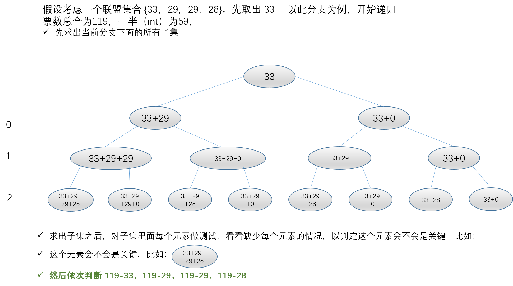
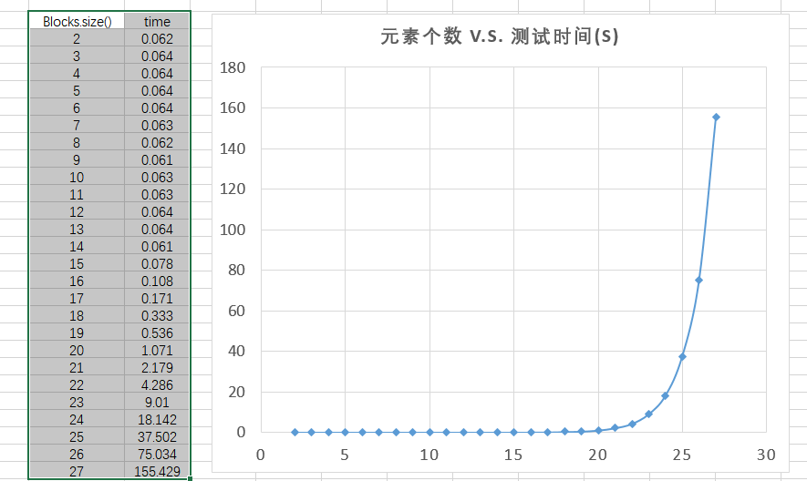
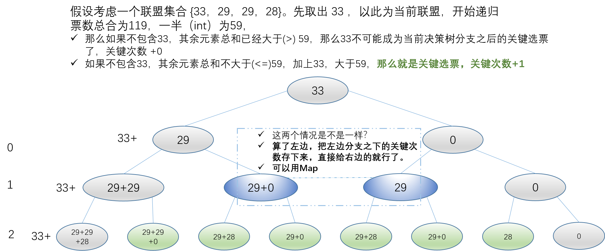
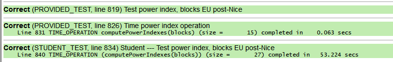
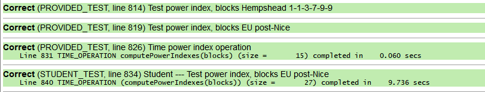
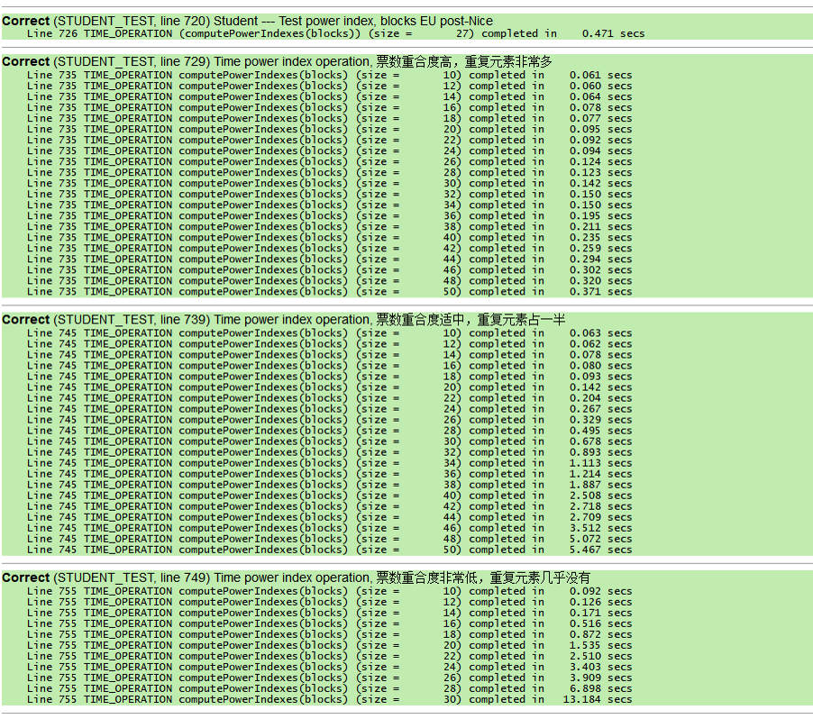
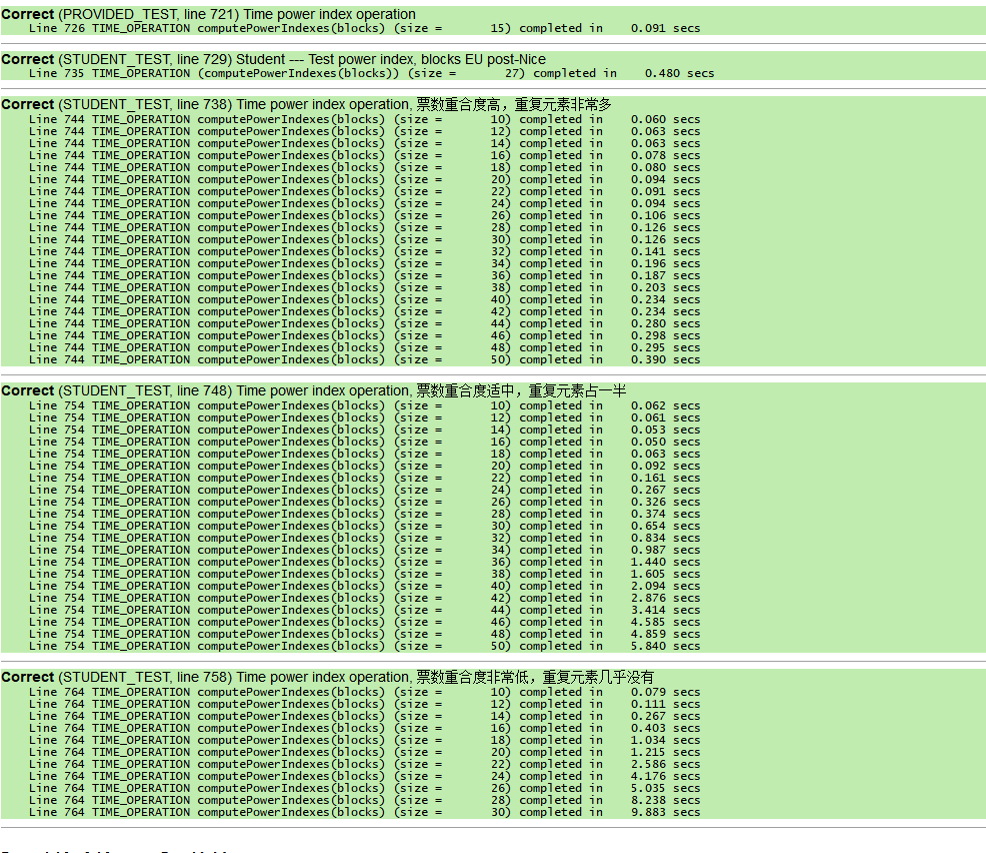
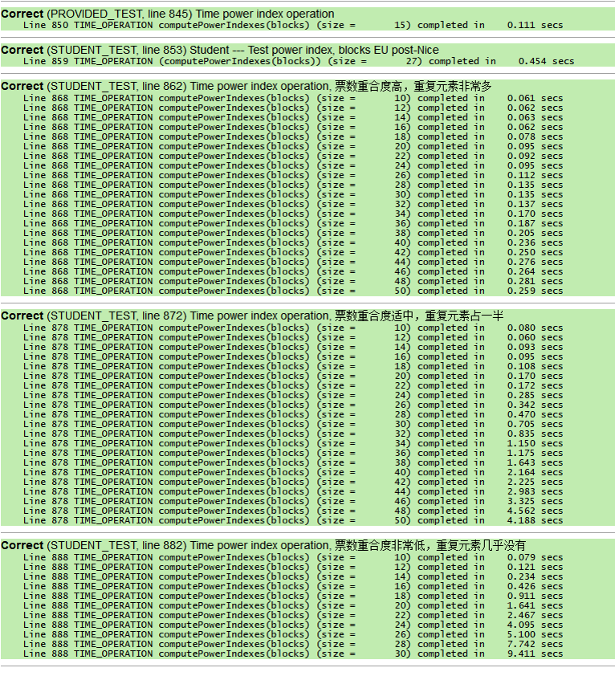

# 作业 3.2 递归回溯，关于Voting的思考整理

## 目标
+ 通过将问题划分为一个或者多个 Base Case 和 Recursive Case 来开发递归算法。
+ 利用 **递归回溯** 技术，解决迭代方法无法轻松解决的问题。
+ 实现 **更高级的递归算法**，解决迭代方法无法轻松解决的问题。

--------------------------
## 第三部分 投票系统

+ 在美国系统中，每个州是一个区块，根据其人口规模有特定数量的选票
+ 州内的选举决定了该区块作为一个整体投票的方向
+ 衡量一个区块的重要性或投票“权力”的一个指标是在选举结果中，该区块符合我们所说的“关键选票”的次数。
+ **关键选票** 对于一个给定的投票区块 B，如果没有 B 就会输掉选举；如果有 B 就会赢得选举，那么 B 称为关键选票。也就是说，B 能够左右选举的结果。
+ Banzhaf 影响力指数用于表示一个区块的投票权重，即该区块在所有关键选票总数中所占的百分比。

#### 注意事项
+ 平局。为了赢得选举，联盟必须获得严格的多数选票，平局不被视为获胜的联盟。
- 舍入。我们将影响力指数计算为一个整数，这是一个舍入的值（确切地说，小数部分会被截掉）。所以最终的影响力指数总和可能是 99 而不是 100。
- 递归思路。可以参考类似子集探索的经典包含/排除模式的代码。
+ 效率。尝试所有子集的穷举递归，在计算上是非常耗时的。
  - 一旦发现无论目标区块是否参与，联盟都将获胜，就没有必要进一步探索这条道路。目标区块不可能成为这个联盟中的关键选票。
  - 在使用 ADT 时要深思熟虑，并注意避免不必要的复制操作（ADT 作为参数传值或从函数返回时，都将产生复制操作）。
  - 此外，不要试图首先构建所有联盟的子集，然后再处理联盟。考虑到一个投票系统，即使只有少量的块，仍然会消耗大量的内存。相反，你必须一次探索一个联盟：先组建出一个联盟，测试它，取消选择并回溯，然后再组建另一个联盟，不断地探索。在任何时候，只有一个组建好的联盟会存放在内存中。

#### 函数实现----这是一个完全基于决策树，而且很难（没法）优化的版本

示意图



+ 递归函数，用于获得每个区块作为关键区块的次数
  
    ```c++
    /** \param blocks      原始的所有区块联盟
     *  \param tempSubset  栈，当前的临时子集
     *  \param index       当前决策树到达的索引
     *  \param sumBlocks   总共有多少积分
     *  \param sumSubset   现在这个联盟有多少积分
     *  \param powerIndex  栈，记录子集里面的元素在 blocks 里面的位置索引，用于计数
     *  \param result      向量，记录每个目标区块成为关键区块的次数
     */
    void computePowerIndexesRec(const Vector<int> &blocks,
                                Stack<int> &tempSubset,
                                int index,
                                const int sumBlocks,
                                int sumSubset,
                                Stack<int> &powerIndex,
                                Vector<int> &result)
    {
        // 每一个决策树分支都遍历 blocks.size() 次
        // 不管最后有几个元素，只要遍历次数够了，到达决策树末端，就加入子集的集合
        if (index == blocks.size())
        {
            Stack<int> powerIndex01 = powerIndex;
            const int powerIndexSize = powerIndex.size();
            for (int i = 0; i < powerIndexSize; ++i)
            {
                // 有这个区块，获胜或平均，
                // 且 没有这个区块，必输
                int item = powerIndex01.pop();
                if (sumSubset > sumBlocks / 2 && (sumSubset - blocks[item]) <= sumBlocks / 2)
                {
                    result[item]++;
                }
            }
        }
        else
        {
            if (sumSubset <= sumBlocks / 2)
            {
                // -------------------------------------------------------
                // 递归过程不能改变中间变量值
                // 如果积分票数不大于一半的总票数，当前选票可能会是关键票数
                // 然后就要包含这个索引
                // -------------------------------------------------------

                // 加入下一个区块的子集联盟
                tempSubset.push(blocks[index]);
                powerIndex.push(index);
                sumSubset += blocks[index];
                computePowerIndexesRec(blocks, tempSubset, index + 1, sumBlocks, sumSubset, powerIndex, result);
                // 不加入目标区块（即，加入空寂空集）的子集联盟
                sumSubset -= blocks[index];
                tempSubset.pop();

                powerIndex.pop();
                computePowerIndexesRec(blocks, tempSubset, index + 1, sumBlocks, sumSubset, powerIndex, result);
            }
            else
            {
                // -------------------------------------------------------
                // 如果积分票数已经大于一半的总票数，当前选票可能会是关键票数
                // 那么有没有后面的票都无所谓，后面的不可能成为关键票数
                // 不必包含这个索引
                // -------------------------------------------------------

                // 递归过程不能改变中间变量值
                tempSubset.push(blocks[index]);
                sumSubset += blocks[index];
                computePowerIndexesRec(blocks, tempSubset, index + 1, sumBlocks, sumSubset, powerIndex, result);
                // 不加入目标区块（即，加入空寂空集）的子集联盟
                sumSubset -= blocks[index];
                tempSubset.pop();
                computePowerIndexesRec(blocks, tempSubset, index + 1, sumBlocks, sumSubset, powerIndex, result);
            }
        }
    }
    ```

+ 包装函数，获得 Banzhaf 影响力指数
    ```c++
    Vector<int> computePowerIndexesMy02(Vector<int> &blocks)
    {
        Vector<int> result;
        // TODO your code here
        // 记录子集联盟里面的区块在 blocks 里面的位置索引，用于计数
        Stack<int> powerIndex;
        // 记录每个区块成为关键区块的次数,每一个计数都从零开始
        Vector<int> resultSocre(blocks.size(), 0);
        // 决策树索引
        int index = 0;
        // 临时联盟子集
        Stack<int> tempSubset;
        const int sumBlocks = sumVecInt(blocks);
        // 积分总和
        int sumSubset = 0;

        // 开始递归
        computePowerIndexesRec(blocks, tempSubset, index, sumBlocks, sumSubset, powerIndex, resultSocre);

        cout << "-------------------------------------------------------" << endl;
        int sumAllPoint = sumVecInt(resultSocre);
        for (const int item : resultSocre)
        {
            // 为了保险起见，除法先强制转换为double，结果再强制转换为int
            result.add(int(double(item) / sumAllPoint * 100));
            cout << item << ", ";
        }
        cout << endl;
        return result;
    }
    ```
+ 再包装一下，把自己写的函数包装进题目的函数
    ```c++
    // TODO: Add a function header comment here to explain the
    // behavior of the function and how you implemented this behavior
    Vector<int> computePowerIndexes(Vector<int> &blocks)
    {
        Vector<int> result;
        // TODO your code here
        result = computePowerIndexesMy02(blocks);
        return result;
    }
    ```

#### Q21. 函数 computePowerIndex 的大 O 是多少？包括你的计时数据并解释它如何支持你的推理。
主要就是求出 递归函数 `computePowerIndexesRec` 的复杂度

**思路记录：**
+ **决策树的复杂度应该为 $2^N$**，其中，$N$ 是元素个数
+ 递归里面的操作，尽量都选用 $O(1)$的操作。之前 临时区块变量 `tempSubset` 和索引集合 `powerIndex` 都用了 `Vector`，但是在决策的时候，需要 `add` 和 `remove` 操作，`remove` 的复杂度是 $O(M)$，$M$ 是元素个数，而且每次子递归都要用到 `remove`。
+ 最终决定把这两个 `Vector` 换成了 `Stack`，因为它的 `pop` 和 `push` 操作 复杂度都是 $O(1)$。
+ 用 `Stack` 在最后一次递归，由于要遍历`powerIndex`，只能创建一个副本，挨个弹出遍历，这样相当于**每个决策树分支加了一次 $O(N)$ 操作**。
+ 然后还有其他 $O(1)$ 的操作，大概每个子递归有不到10次，**就按 8 次算吧** （这些 $O(1)$ 操作其实可以忽略）
+ 关于为什么不用 `queue`？这是由于 `queue` 在 `dequeue` 和 `enqueue` 操作的不是同一个元素，而决策树两个分支是要加入并取出当前元素。
+ 将两个 `Vector` 换成 `Stack` 操作，经测试，大概可以使 `EU post-Nice` 测试快 8~10 秒。

所以最后得到的复杂度应该是

$$
O(2^N \times (1 + 8 + N)) \sim O(N \times 2^N)
$$

最后测试了 2-27个元素的执行时间，结果画图




## 思路二 ----- 重要

**示意图如下**



### 朴素的做法
```c++
// 自己先写一个求和函数
template <class T>
T sumVecInt(const Vector<T> &vec)
{
    T sum = 0;
    for (const auto &item : vec)
    {
        sum += item;
    }
    return sum;
}

// 挨个寻找关键票数组合
void computePowerIndexesHelper(const Vector<int>& blocks,
                              const int currentBlockIndex,
                              const int halfSumBlocks,
                               int &thisBlockPoint,
                               int sumSubset,
                              int index) { // v2 start
    if(index == currentBlockIndex){
        index++;
    }

    if(sumSubset - blocks.get(currentBlockIndex) > halfSumBlocks){
        ;
    }
    else{
        if(index == blocks.size()){
            if((sumSubset - blocks.get(currentBlockIndex) <= halfSumBlocks) &&
                (sumSubset > halfSumBlocks)){
                thisBlockPoint ++;
            }
        }
        else{
            sumSubset+=blocks[index];
            computePowerIndexesHelper(blocks, currentBlockIndex, halfSumBlocks,
                                      thisBlockPoint, sumSubset, index+1);
            sumSubset-=blocks[index];
            computePowerIndexesHelper(blocks, currentBlockIndex, halfSumBlocks,
                                      thisBlockPoint, sumSubset, index+1);
        }
    }

}

// TODO: Add a function header comment here to explain the
// behavior of the function and how you implemented this behavior
Vector<int> computePowerIndexes(Vector<int>& blocks)
{
    Vector<int> result;
    // TODO your code here

    const int sumBlocks = sumVecInt(blocks);
    const int halfSumBlocks = sumBlocks / 2;

    for(int i = 0; i < blocks.size(); ++i){
        int thisPoint = blocks.get(i);
        result.add(0);
        computePowerIndexesHelper(blocks,i ,halfSumBlocks, result[i], thisPoint, 0);
    }

    cout << "-------------------------------------------------------" << endl;
    int sumAllPoint = sumVecInt(result);

    for(int i = 0; i < result.size();++i){
        result[i] = int(double(result.get(i)) / sumAllPoint * 100);
         cout << result[i] << ", ";
    }
    cout << endl;
    return result;
}
```



复杂度大概是 

$$
O(N \times 2^{N-1})
$$

+ 指数是 $N-1$，这是因为在递归的时候，跳过当前元素，比纯决策树少一次递归。
+ 这个实现大概比第一种方法快一倍，
+ 而且省去先求子集再判断一些操作，
+ 还有很大的优化潜力。

### 高效的实现方法，有去重的做法

```c++
// 自己先写一个求和函数
template <class T>
T sumVecInt(const Vector<T> &vec)
{
    T sum = 0;
    for (const auto &item : vec)
    {
        sum += item;
    }
    return sum;
}

// 挨个寻找关键票数组合
void computePowerIndexesHelper(const Vector<int>& blocks,
                               const int &currentBlockIndex,
                               const int &halfSumBlocks,
                               int &thisBlockPoint,
                               const int sumSubset,
                                int index) { // v2 start
    if(index == currentBlockIndex){
        index++;
    }


    if(sumSubset > halfSumBlocks){
        ;
    }
    else if(index == blocks.size()){
        if((sumSubset <= halfSumBlocks) &&
            (sumSubset+blocks[currentBlockIndex] > halfSumBlocks)){
            thisBlockPoint ++;
        }
    }
    else{
        int temp = blocks.get(index);
        computePowerIndexesHelper(blocks, currentBlockIndex, halfSumBlocks,
                                  thisBlockPoint, sumSubset+temp, index+1);

        computePowerIndexesHelper(blocks, currentBlockIndex, halfSumBlocks,
                                  thisBlockPoint, sumSubset, index+1);
    }
}

// TODO: Add a function header comment here to explain the
// behavior of the function and how you implemented this behavior
Vector<int> computePowerIndexes(Vector<int>& blocks)
{
    Vector<int> result;
    // TODO your code here

    const int sumBlocks = sumVecInt(blocks);
    const int halfSumBlocks = sumBlocks / 2;

    Map<int, int> alreadyCountedBlocks;
    for(int i = 0; i < blocks.size(); ++i){

        if (!alreadyCountedBlocks.containsKey(blocks.get(i))) {
            int thisPoint = 0;
            result.add(0);
            computePowerIndexesHelper(blocks,i ,halfSumBlocks, result[i], thisPoint, 0);
            alreadyCountedBlocks.put(blocks.get(i), result[i]);
        }
        else{
            result.add(alreadyCountedBlocks.get(blocks.get(i)));
        }
    }

    cout << "-------------------------------------------------------" << endl;
    int sumAllPoint = sumVecInt(result);

    for(int i = 0; i < result.size();++i){
        result[i] = int(double(result.get(i)) / sumAllPoint * 100);
        cout << result[i] << ", ";
    }
    cout << endl;
    return result;
}
```




### 一个更高效的实现方法

#### Niu 同学的方法，int函数，return 参数累加，迭代 + 递归
```c++
// 将提供向量中的元素值求总和 int
int sumOf(const Vector<int>& vec) {
    int total = 0;
    for (int v : vec) {
        total += v;
    }
    return total;
}

// 将提供向量中的元素值求总和 unsigned long long int
unsigned long long int sumOf(const Vector<unsigned long long int>& vec) {
    unsigned long long int total = 0;
    for (unsigned long long int v : vec) {
        total += v;
    }
    return total;
}

// 将提供向量中的元素值相对于所有元素值之和进行百分比转换
Vector<int> percentConversion(const Vector<unsigned long long int>& keyBlocks) {
    Vector<int> result;

    for (int i = 0; i < keyBlocks.size(); i++) {
        int n = (long double)(keyBlocks[i]) / sumOf(keyBlocks) * 100;
        result.add(n);
    }

    return result;
}


// computePowerIndexes的辅助函数
// 找出不包括当前地区的所有组合（子集）并判断该地区是否为该组合的关键票。
// 最终返回当前地区的关键票总数。

unsigned long long int computePowerIndexesHelper(
                              const Vector<int>& blocks,
                              const int& winVotes,
                              const int& targetBlock,
                              unsigned long long int soFarVotes,
                              unsigned long long int index,
                              const int& blocksSize,
                              Map<Vector<unsigned long long int>, unsigned long long int>& calculatedSubsets
                              ) {


    // 不加当前地区的票数已经胜选，则当前地区肯定不是关键区，该二叉树节点向下所有节点均不是关键区，不需要再继续了
    if (soFarVotes >= winVotes)
        return 0;
    if(calculatedSubsets.containsKey({soFarVotes, index}))
        return calculatedSubsets.get({soFarVotes, index});


    if (index == blocks.size()) {

        // 当组合总票数未超过总票数的一半 且 加上当前地区的票就能超一半，说明当前地区是关键区，返回 1。
        if (soFarVotes < winVotes && soFarVotes + targetBlock >= winVotes)
            return 1;

    } else {

        unsigned long long int n1 = computePowerIndexesHelper(blocks, winVotes, targetBlock, soFarVotes + blocks[index], index + 1, blocksSize, calculatedSubsets); // 包含的情况

        unsigned long long int n2 = computePowerIndexesHelper(blocks, winVotes, targetBlock, soFarVotes, index + 1, blocksSize, calculatedSubsets); // 不包含的情况

        unsigned long long int total = n1 + n2;

        calculatedSubsets.put({soFarVotes, index}, total);

        //if (index == 0)
        //    cout << "Map Size: " << calculatedSubsets.size() << endl;

        return total;
    }
    return 0;
}

/*
 * 此函数计算区块的Banzhaf影响力指数。
 * 接收包括区块票数的向量作为参数，
 * 返回包含各个区块Banzhaf影响力指数的向量。
*/
Vector<int> computePowerIndexes(Vector<int>& blocks){
    // 计算胜选票数
    int winVotes = 0;
    int totalVotesBlocks = sumOf(blocks);
    winVotes = (totalVotesBlocks / 2) + 1;


    Vector<unsigned long long int> keyBlocks;

    Map<unsigned long long int, unsigned long long int> alreadyCountedBlocks;

    int blocksSize = blocks.size();
    for (int i = 0; i < blocksSize; i++) {
        Map<Vector<unsigned long long int>, unsigned long long int> calculatedSubsets;
        int block = blocks[i];
        if (!alreadyCountedBlocks.containsKey(block)) {
            Vector<int> newBlocks = blocks;
            newBlocks.remove(i);
            unsigned long long int keyBlock = computePowerIndexesHelper(newBlocks, winVotes, block, 0, 0, blocksSize - 1, calculatedSubsets);
            keyBlocks.add(keyBlock);
            alreadyCountedBlocks.put(block, keyBlock);
        } else {
            keyBlocks.add(alreadyCountedBlocks.get(block));
        }
    }

    //cout << endl << keyBlocks << endl;
    Vector<int> result = percentConversion(keyBlocks);
    cout << endl << result << endl;
    //return percentConversion(keyBlocks);
    return result;
}
```



#### 改动1，void 函数，函数中累加，不返回值，迭代+递归

```c++
typedef unsigned long long int theType;

// 自己先写一个求和函数
template <class T>
T sumVecInt(const Vector<T> &vec)
{
    T sum = 0;
    for (const auto &item : vec)
    {
        sum += item;
    }
    return sum;
}

void computePowerIndexesHelper(const Vector<int>& blocks,
                               const theType halfSumBlocks,
                               const theType sumSubset,
                               theType &thisBlockPoint,
                               const int thisBlock,
                               Map<Vector<int>, theType>& calculatedSubsets,
                               int index)
{

//    Vector<int> thisSubset = {thisBlock, sumSubset, index};
    Vector<int> thisSubset = { sumSubset, index};

    // 不加当前地区的票数已经胜选，则当前地区肯定不是关键区，该二叉树节点向下所有节点均不是关键区，不需要再继续了
    if(sumSubset > halfSumBlocks){
        ;
    }
    else if (calculatedSubsets.containsKey(thisSubset)){
        // 如果这个子集之前已经被计算过，直接代入上一次计算的值
        thisBlockPoint += calculatedSubsets.get(thisSubset);
    }
    // 如果递归到头了
    else if (index == blocks.size()) {
        // 判断是否是关键区域的条件
        if((sumSubset <= halfSumBlocks) &&
            (sumSubset+thisBlock > halfSumBlocks)){
            thisBlockPoint++;
        }
    }
    else
    {
        int temp = blocks.get(index);
        theType before = thisBlockPoint;
        computePowerIndexesHelper(blocks, halfSumBlocks, sumSubset+temp,
                                  thisBlockPoint, thisBlock, calculatedSubsets,index+1);

        computePowerIndexesHelper(blocks, halfSumBlocks, sumSubset,
                                  thisBlockPoint, thisBlock, calculatedSubsets,index+1);
        theType rec2 = thisBlockPoint;
        calculatedSubsets.put(thisSubset, rec2-before);

    }
}

// TODO: Add a function header comment here to explain the
// behavior of the function and how you implemented this behavior
Vector<int> computePowerIndexes(Vector<int>& blocks)
{
    Vector<int> result;
    // TODO your code here

    Vector<theType> result00;

    const theType sumBlocks = sumVecInt(blocks);
    const theType halfSumBlocks = sumBlocks / 2;

    Map<int, theType> alreadyCountedBlocks;
    int blocksSize = blocks.size();

    for(int i = 0; i < blocksSize; ++i){
        int thisBlock = blocks.get(i);
        Map<Vector<int>, theType> calculatedSubsets;

        if (!alreadyCountedBlocks.containsKey(thisBlock)) {
            Vector<int> blocksWithoutThis = blocks;
            blocksWithoutThis.remove(i);
            // 给 result 加上一个元素
            result00.add(0);
            // 递归计算结果
            computePowerIndexesHelper(blocksWithoutThis,halfSumBlocks, theType(0),
                                         result00[i], thisBlock, calculatedSubsets, 0);
            // 给map加上这个结果
            alreadyCountedBlocks.put(thisBlock, result00[i]);
        }
        else{
            result00.add(alreadyCountedBlocks.get(thisBlock));
        }
    }

    cout << "-------------------------------------------------------" << endl;
    theType sumAllPoint = sumVecInt(result00);

    for(int i = 0; i < result00.size();++i){
        result.add(0);
        result[i] = int(double(result00.get(i)) / sumAllPoint * 100);
        cout << result00[i] << ", ";
    }
    cout << endl;
    return result;
}
```



#### 改动2，void 函数，函数中累加，不返回值，递归+递归
```c++
typedef unsigned long long int theType;

// 自己先写一个求和函数
template <class T>
T sumVecInt(const Vector<T> &vec)
{
    T sum = 0;
    for (const auto &item : vec)
    {
        sum += item;
    }
    return sum;
}

void computePowerIndexesHelper(const Vector<int>& blocks,
                               const theType halfSumBlocks,
                               const theType sumSubset,
                               theType &thisBlockPoint,
                               const int thisBlock,
                               Map<Vector<int>, theType>& calculatedSubsets,
                               int index)
{

    //    Vector<int> thisSubset = {thisBlock, sumSubset, index};
    Vector<int> thisSubset = {sumSubset, index};

    // 不加当前地区的票数已经胜选，则当前地区肯定不是关键区，该二叉树节点向下所有节点均不是关键区，不需要再继续了
    if(sumSubset > halfSumBlocks){
        ;
    }
    else if (calculatedSubsets.containsKey(thisSubset)){
        // 如果这个子集之前已经被计算过，直接代入上一次计算的值
        thisBlockPoint += calculatedSubsets.get(thisSubset);
    }
    // 如果递归到头了
    else if (index == blocks.size()) {
        // 判断是否是关键区域的条件
        if((sumSubset <= halfSumBlocks) &&
            (sumSubset+thisBlock > halfSumBlocks)){
            thisBlockPoint++;
        }
    }
    else
    {
        int temp = blocks.get(index);
        theType before = thisBlockPoint;
        computePowerIndexesHelper(blocks, halfSumBlocks, sumSubset+temp,
                                  thisBlockPoint, thisBlock, calculatedSubsets,index+1);

        computePowerIndexesHelper(blocks, halfSumBlocks, sumSubset,
                                  thisBlockPoint, thisBlock, calculatedSubsets,index+1);
        theType rec2 = thisBlockPoint;
        calculatedSubsets.put(thisSubset, rec2-before);

    }
}

void computePowerIndexesRec(const Vector<int>& blocks,
                            Vector<theType>& result00,
                            const theType halfSumBlocks,
                            Map<int, theType> &alreadyCountedBlocks,
                            int index){


    if(index == blocks.size()){

    }
    else{
        int thisBlock = blocks.get(index);
        if(!alreadyCountedBlocks.containsKey(thisBlock))
        {
            Map<Vector<int>, theType> calculatedSubsets;
            Vector<int> blocksWithoutThis = blocks;
            blocksWithoutThis.remove(index);

            computePowerIndexesHelper(blocksWithoutThis,halfSumBlocks, theType(0),
                                      result00[index], thisBlock, calculatedSubsets, 0);

            alreadyCountedBlocks.put(thisBlock, result00[index]);
        }
        else
        {
            result00[index] = (alreadyCountedBlocks.get(thisBlock));
        }
        computePowerIndexesRec(blocks,result00,halfSumBlocks, alreadyCountedBlocks,index+1);
    }
}

// TODO: Add a function header comment here to explain the
// behavior of the function and how you implemented this behavior
Vector<int> computePowerIndexes(Vector<int>& blocks)
{
    Vector<int> result;
    // TODO your code here

    Vector<theType> result00(blocks.size(),0);

    const theType sumBlocks = sumVecInt(blocks);
    const theType halfSumBlocks = sumBlocks / 2;

    Map<int, theType> alreadyCountedBlocks;
    int blocksSize = blocks.size();

    computePowerIndexesRec(blocks, result00, halfSumBlocks, alreadyCountedBlocks, 0);

    cout << "-------------------------------------------------------" << endl;
    theType sumAllPoint = sumVecInt(result00);

    for(int i = 0; i < result00.size();++i){
        result.add(0);
        result[i] = int(double(result00.get(i)) / sumAllPoint * 100);
        cout << result00[i] << ", ";
    }
    cout << endl;
    return result;
}
```

