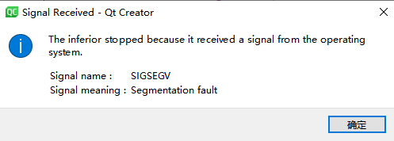
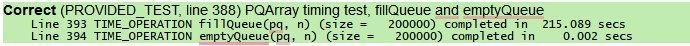
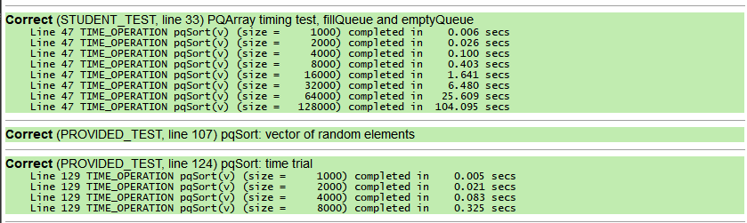
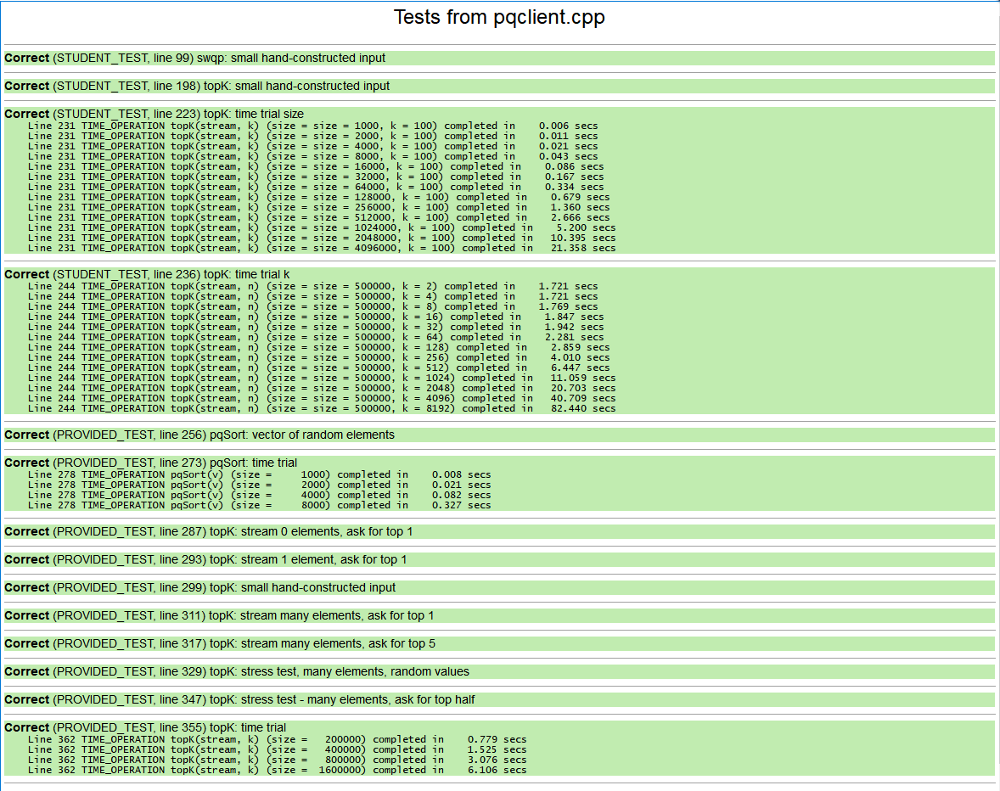
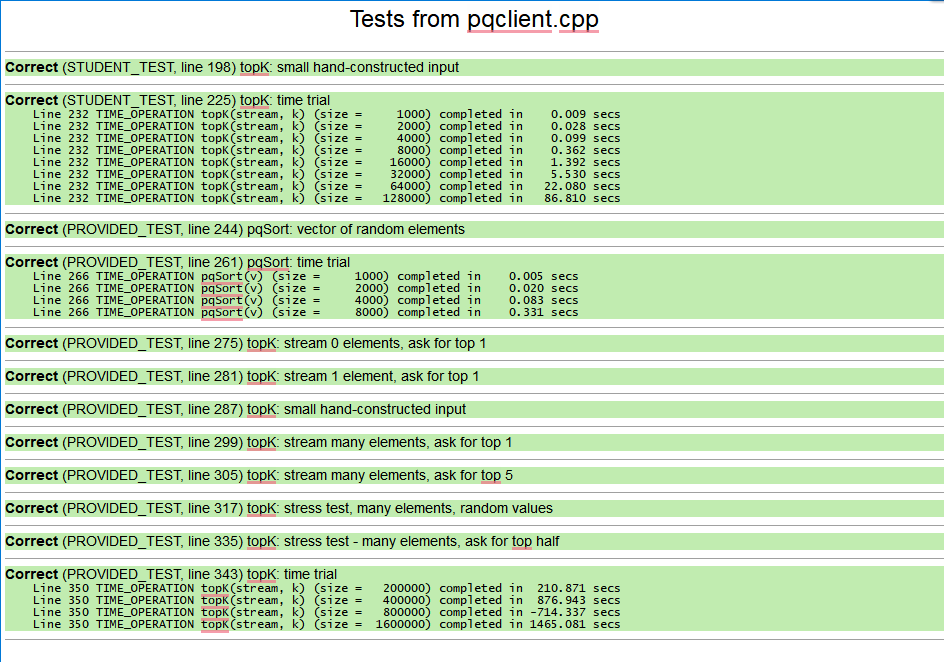
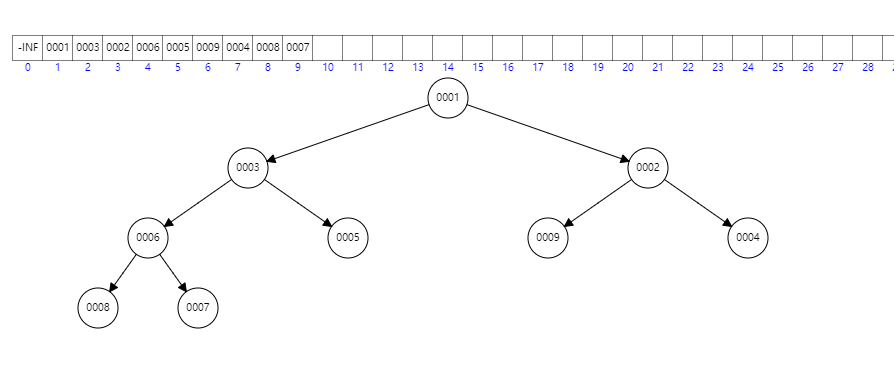
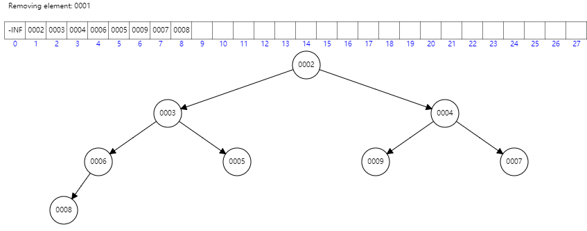
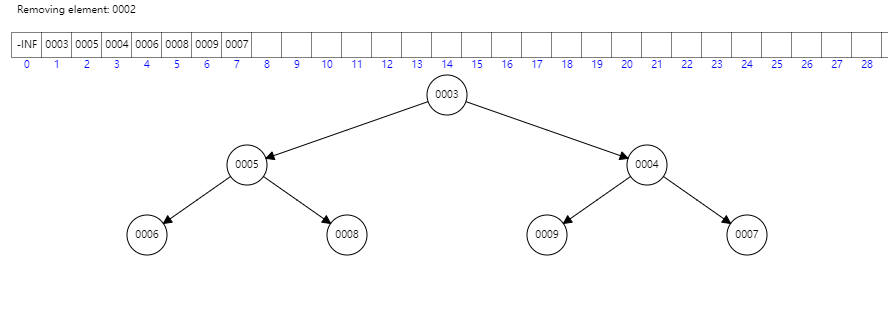
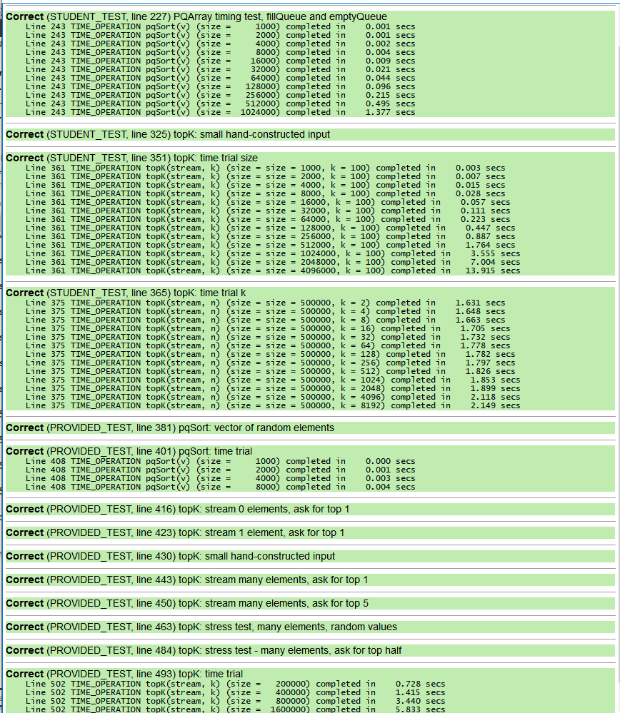
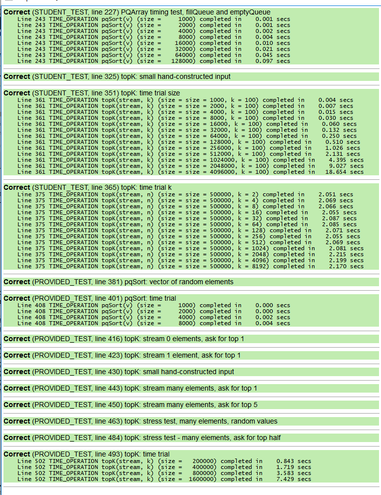

# 作业 4. 优先级队列

**优先级队列类:** 这是标准队列的变体，区别于先进先出，其元素是按相对优先级顺序处理的。
+ 第一种使用**数组**，
+ 第二种使用更有效的**二叉堆**。
+ 分析和编写使用该数据类型的客户端代码
+ 反思两个实现中的权衡以及其他替代方案

**目标：** 
+ 定义实现**类**
+ **角色** 实现者——客户端
+ **指针**、**动态数组**以及使用 **new/delete** 的**显式内存管理**。
+ 意识到在使用**内存和指针**时需要保持警惕
+ 确定不同实现方案中的**权衡**
+ 解释这些选择如何影响**数据结构的灵活性和效率**

----------

## 第一部分 热身

###练习对象以及数组/内存的调试技巧

#### Q1. allBalls[0] 成员变量的值如何在迭代中变化？具体来说，_id、_x 和 _y 的值会发生什么？

**答案** `_id` 不会变化，`_x` 和 `_y` 每次都要加上各自的速度值 `_x - _vx`，`_y - _vy`。


+ **bug:** 藏在边缘的球并没有正确地移动；它们沿着边缘摆动，好像被“卡住”了一样

#### Q2. 在不断的迭代中，卡住的球的成员变量是如何变化的？跟上一个问题的答案做个比较。

**答案** 卡住以后，`_vx`和`_vy`每一次都变为相反数，相应的位置也就无限重复变化。

#### Q3. 强制把卡住的球放置到 (0, 0) 位置会恢复正常吗？还是仍然卡住？

**答案** 会恢复正常

**条件断点可以让你跳过许多不相关量**

**解决方法** 由于小球尺寸 `SIZE` 太大，得在初始给定小球的时候就把它限制在窗口里面。

```cpp
Ball::Ball(int id, GWindow* w) {
    _window = w;
    _id = id;
    _x = randomInteger(0, _window->getWidth()-SIZE);
    _y = randomInteger(0, _window->getHeight()-SIZE);
//    _x = randomInteger(0+MAX_VELOCITY, MIN_VELOCITY+ _window->getWidth());
//    _y = randomInteger(0+MAX_VELOCITY, MIN_VELOCITY+ _window->getHeight());
    _vx = randomInteger(MIN_VELOCITY, MAX_VELOCITY);
    _vy = randomInteger(MIN_VELOCITY, MAX_VELOCITY);
}
```

### 调试数组和内存

指针可能是 C++ 语言中相当致命的部分

+ 对于每个测试用例，你都要观察在没有调试器的情况下会发生什么，并在调试模式下再次测试它。
+ 一些内存错误会有明确的报错信息；其他的则可能暗地里做一些阴险的操作，没有任何预兆。
同样的错误，在不同的上下文中或在不同的操作系统上执+ 行时，可能会得到不同的结果。
+ 所有这些因素都造成了调试内存错误变得更具挑战。

#### Q4. 在你的系统上，这些内存错误的观察结果是什么：

- 访问分配的数组边界之外的索引？  
  + 分配时数组越界，没有提示和报错    
- 两次删除相同的内存？   
  + 调试模式有报错，运行模式直接异常退出，没有任何提示
  
  


- 删除后访问内存？
  + 没有报错，内存元素还在保持。
  + **这个很诡异！！！**

-------------------

## 第二部分 基于数组的优先级队列

+ **标准队列** 先进先出 (FIFO)
+ **优先级队列** 每个元素都以关联的优先级入队，检索具有最紧急优先级的元素出队。

### 数组版优先级队列实现

#### Q5. 接口 (pqarray.h) 和实现 (pqarray.cpp) 中都有大量注释。解释接口中的注释与实现中的注释为什么不同。考虑下文档的内容和受众。

**答案** `.h` 中的注释是给用户看的，其作用，复杂度以及调用形参都给出了。 `.cpp` 中的注释需要给程序员看，写得更简略，此外程序员还要看头文件中的内容。

#### Q6. 该类声明了成员变量 _numAllocated 和 _numFilled。这两个计数有什么区别，为什么都需要？

**答案** `_numAllocated` 用于声明可用内存空间，`_numFilled` 用于表示存放有效数据的大小。优先级数组可能扩容后，或者弹出了几个值，这就导致实际用户层面的数组长度小于申请的内存空间。用户层面只需要知道 `_numFilled`，而程序实现还需要知道 `_numAllocated`。


#### Q7. 尽管成员函数体内的代码可以直接访问对象的成员变量，但实现者可以选择调用公共成员函数来获取有关对象的信息。例如，请注意操作 isEmpty() 和 peek() 为何故意调用 size() 而不是使用 _numFilled 或者 dequeue() 为何调用  peek() 来检索最前面的元素。为什么这样的写法，被认为是更好的设计？

**答案** 优先采用已经实现的接口，这样后续优化代码的时候只需要优化很少的函数。比如 `isEmpty()` 函数如果也用 `_numFilled==0`，那么后期如果 `_numFilled` 这个私有变量被优化了，那么方法实现就需要改两处。而如果`isEmpty()` 函数调用 `size()`，那么后续只需要改动 `size()` 一处代码。


#### Q8. 给出你的时间试验的结果，并解释它们如何支持你对入队和出队的 Big-O 运行时的预测。

+ `expand()` 扩容辅助函数实现如下，其复杂度为 $O(n)$

   ```cpp
   void PQArray::expand()
   {
       // do sth
       DataPoint *oldElems = _elements;
       _numAllocated *= 2;
       _elements = new DataPoint[_numAllocated];
       for (int j = 0; j < _numFilled; j++)
       {
           _elements[j] = oldElems[j];
       }
       delete[] oldElems;
   }
   ```
+ `enqueue(DataPoint elem)` 函数实现如下
  
  ***这个函数最好还是用循环实现。如果用递归，在巨量数据压力测试的时候，会出现递归栈过多而导致程序崩溃的情况。***


  ```cpp
  void PQArray::enqueue(DataPoint elem)
  {
      /* TODO: Implement this function. */
      // 如果已有元素和申明空间一样，那么扩容
      if (_numFilled == _numAllocated)
      {
          this->expand();
      }
      _elements[_numFilled] = elem;
      _numFilled += 1;
      // 如果超过两个元素，那么就交换位置
      if (_numFilled > 1)
      {
          for (int i = _numFilled - 2; i >= 0; --i)
          {
              if (_elements[i + 1].priority > _elements[i].priority)
              {
                  swap(i + 1, i);
              }
          }
      }
  }
  ```


  ```cpp
  // 递归辅助函数
  void PQArray::swapRec(int index)
  {
      if (index == 0)
      {
          ;
      }
      else
      {
          if (_elements[index].priority > _elements[index - 1].priority)
          {
              swap(index, index - 1);
              swapRec(index - 1);
          }
      }
  }
  void PQArray::enqueue(DataPoint elem)
  {
      /* TODO: Implement this function. */
      // 如果已有元素和申明空间一样，那么扩容
      if (_numFilled == _numAllocated)
      {
          this->expand();
      }
      _elements[_numFilled] = elem;
      _numFilled += 1;
      // 如果超过两个元素，那么就交换位置
      // 可以用递归实现
      swapRec(_numFilled - 1);
  }
  ```

  一层循环，且循环里面的函数复杂度都是 $O(1)$，得到其复杂度为 $O(n)$

  
  
  为了得到运行时间，取 200000 个长度，那么根据复杂度分析，出队和入队的运行时间应该满足 $1/200000$ 的关系。根据运行时间，出队时间为0.002s，入队时间大约为 215s，其倍数 正比于 $O(200000)$，可以表明我们的实现是正确的。


## 第三部分 使用优先级队列

#### Q9. 基于入队/出队的大 O，如果基于 PQArray 实现，对 pqSort 的大 O 做一个预测？运行一些计时测试以确认你的预测，并将该数据包含在你的答案中。

**答案：** 入队操作的复杂度是 $O(n)$，出队操作复杂度是 $O(1)$，这里有外层循环复杂度也是 $O(n)$，所以最后 `pqSort` 的复杂的是 $O(n^2)$



从图中可以看出，每次将数组元素个数 *2，运行时间大概会翻四倍，证明它的复杂度就是 $O(n^2)$。

#### Q10. 基于入队/出队的大 O，如果使用 PQArray，你对 topK 的大 O 的 k 和 n 有什么期望？运行一些计时试验以确认你的预测，并将该数据包含在你的答案中。

**答案：**

+ **如果始终只保存用 $k$**个元素，那么复杂度应该是 $O(k\times n)$。



+ **如果采用 `PQArray`**，复杂度是 $O(n^2)$。



-----------------------------------------------------------
## 第四部分 基于二叉堆的优先级队列

您将使用的二叉最小堆应存储在扁平数组中。根元素位于索引 0。对于索引 i 处的给定元素，其两个子元素（如果存在）位于索引 2*i + 1 和索引 2*i + 2 处，其父元素位于索引 (i - 1) / 2。

#### Q11. 从一个空的二叉堆开始，按如下所示的顺序将九个数据点排入队列并显示结果。您只需要显示最终堆，而不是中间步骤。将堆绘制为树状图，根元素在顶部，两个子元素在下面，依此类推。



#### Q12. 在上面的二叉堆上进行两次出队调用并绘制更新的结果。




#### Q13. 画出上面二叉堆的数组表示。用数组索引标记每个元素。

见上图

#### Q14. 在 pqclient.cpp 上重新运行计时试验，并提供确认 pqSort 在 O(NlogN) 时间和 O(NlogK) 时间运行 topK 的结果。






通过观察计算时间，可以确定它的复杂度就是这些。
