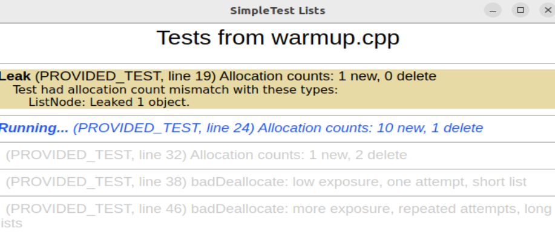
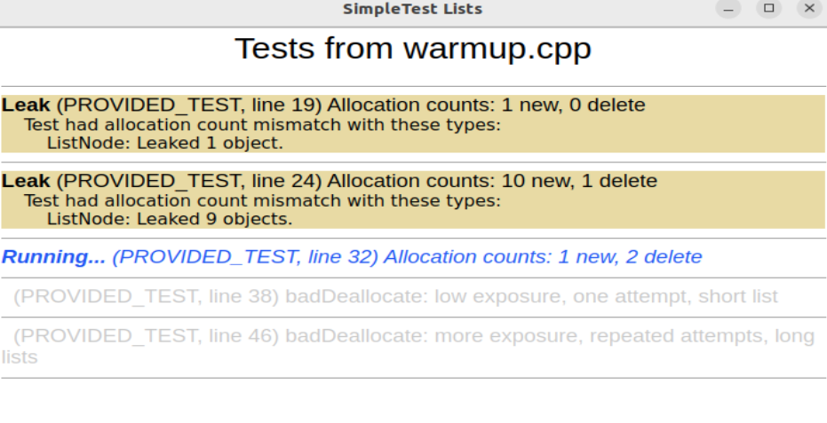
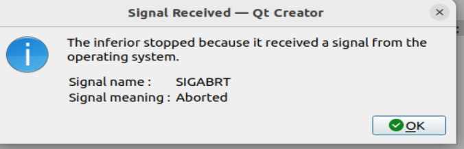
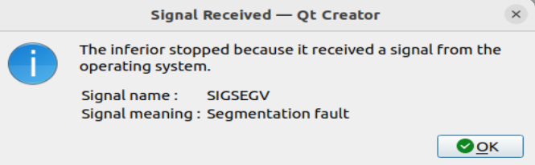
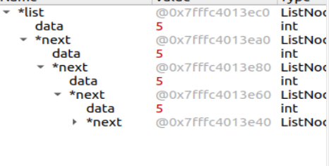
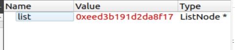

# 作业5 链表


## 第一部分 热身

#### Q1. 测试用例的黄色背景在 SimpleTest 结果窗口中表示什么？ 
**答案：** 表示有内存泄漏



#### Q2. 对已释放的内存地址使用 delete 的测试结果是什么？ 

**答案：** 访问已经删除 delete 的内存会报错



#### Q3. 在你的系统上，观察到 badDeallocate 的后果是什么？错误代码在什么情况下（如果有）触发了错误或崩溃？
**答案：** 



**答案：** `badDeallocate()` 函数，在 `while` 循环中，首先删除了 `list`指针 指向的内容，但是 `ListNode* list` 指针还存在，且指向了垃圾值，不是 `nullptr`，



这就导致下一次 `while` 循环还能执行，再去删除垃圾值，就会报错。




段错误表示程序试图访问无效地址，即试图读取或写入无法访问的内存位置。段错误是错误的症状，但不是错误本身。根源是你的程序使用了无效的地址，才导致了崩溃。

#### Q4. 你的系统上如何呈现段错误？
**答案：** 运行模式直接退出，调试模式弹窗报错


-----------------

## 第二部分 迷宫

#### Q5. 你能想出其他收集所需物品的路径嘛？

**答案：** 还有其他走法，例如：
+ SWWNSEENESNWWNNE
+ ESNWSWWNSEENWNNE


## 第三部分 链表排序


#### Q6. 如果 deallocateList 函数是递归实现的，请粗略估计它可以成功处理的最大长度列表。对于比最大值更长的列表，如果尝试收回内存，观察到的结果是什么？（提示：请参考你在作业 3 中的热身练习）

**答案：** 最大长度和栈空间大小一致。


#### Q7. sort 函数的原型通过引用获取 ListNode*。解释为什么指针本身需要通过引用传递，如果不这样做会产生什么后果。

**答案：**
原来的链表的基本变量就是指针，链表相当于用指针把指针连接起来，所以得传递引用。
如果不使用引用，它就变成了形参，函数内部的变化不会影响函数外的变量值。


#### Q8. 运行时间测试并提供确认 QuickSort 为 O(NlogN) 的结果。构建触发最坏情况的输入，验证运行时间降级到 O(N^2)。
**答案：**

时间：随机数排序
```
      1000  0.000 
      2000  0.000 
      4000  0.001 
      8000  0.001 
     16000  0.003 
     32000  0.007 
     64000  0.016 
    128000  0.038 
    256000  0.123 
    512000  0.293 
   1024000  0.873 
   2048000  2.129 
   4096000  5.209 
   8192000 12.595 
  16384000 32.818 
```
严格逆序排序

```
    1000   0.003
    2000   0.012
    4000   0.042
    8000   0.175
   16000   0.668
   32000   2.627
   64000  10.717
  128000  43.716
```

#### Q9. 运行提供的计时试验，将你的链表快速排序与相同序列上的向量排序进行比较并报告结果。谁赢了，为什么？

**答案：** 链表排序更快，向量排序更慢。经过查询，向量的sort复杂度也是 NlogN，但是却更慢。

**因为指针操作比赋值更快？**
