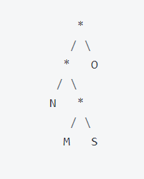
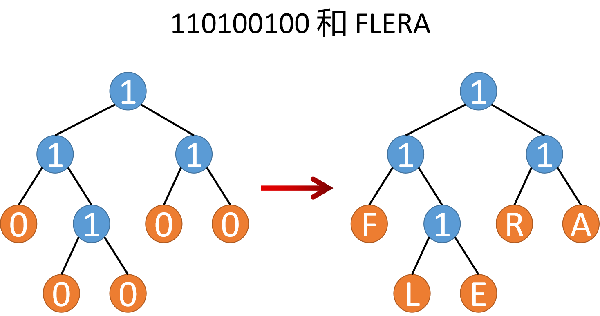

# 作业 6. 哈夫曼编码

## 目标
- 练习构建、操作和遍历二叉树
- 能够综合多种不同的数据结构和算法来完成实际项目
- 了解压缩算法如何根据数据的模式和趋势来优化空间的压缩

## 第一部分 热身

#### Q1. 使用上面的编码树对序列 0101100011 进行解码。

**答案：** MOONS

#### Q2. 为上述编码树制作一个表格，列出每个字符及其分配的位序列。使用表格对字符串“SONS”进行编码。

**答案：**

| 字符    | 编码 |
| ----------- | ----------- |
| M      | 010       |
| O   | 1        |
| N   | 00        |
| S   | 011        |

SONS    011100011

#### Q3. 哈夫曼代码遵循前缀属性（Prefix-Free）：任意字符的编码位序列都不是其他字符的前缀。编码树的什么特征表明它服从前缀属性？

**答案：** 

1. 不同字符之间没有相同的前缀，即一个字符的编码不可能出现在另一个字符编码的前几位中。
2. 所有的字符都储存在叶节点上，内部节点不储存字符，只储存执行路径。

**但一种整洁紧凑的方法是将树概括为两个序列：一个给出树形状的位序列和一个对应于树叶的字符序列。**

#### Q4. 将右上方的编码树展平为位序列和字符序列。

**答案：**
位序列：1101000
字符序列：NMSO

#### Q5. 展开序列 110100100 和 FLERA 以重建原始编码树。

**答案：**

##### 对于给定的字符串，可能会得到许多不同结果的哈夫曼树，但他们都是最优的，不同之处仅在于算法按何种顺序绑定节点。

#### Q6. 为输入“BOOKKEEPER”构造哈夫曼编码树。

**答案：**
BOOKKEEPER

#### Q7. 哈夫曼编码树中的节点有两类，两个非空子节点或没有子节点。为什么哈夫曼树中的节点只有一个非空子节点没有意义？

**答案：** 如果有一个非空子节点，那么这个节点和其非空子节点就浪费了一个位。比如一个节点只有非空子节点，那么这个节点和其非空子节点必然是 xx10的表示，那么它和去掉非空子节点的结果 xx0 所表示的信息是一样的。

<!-- 一旦左边出现了只有一个非空子节点的树，那么这个非空子节点完全可以放到右边，还能减少二叉树的级数。 -->

