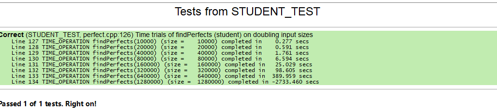
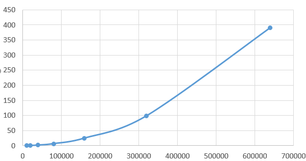
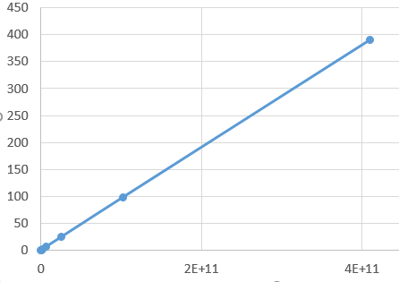
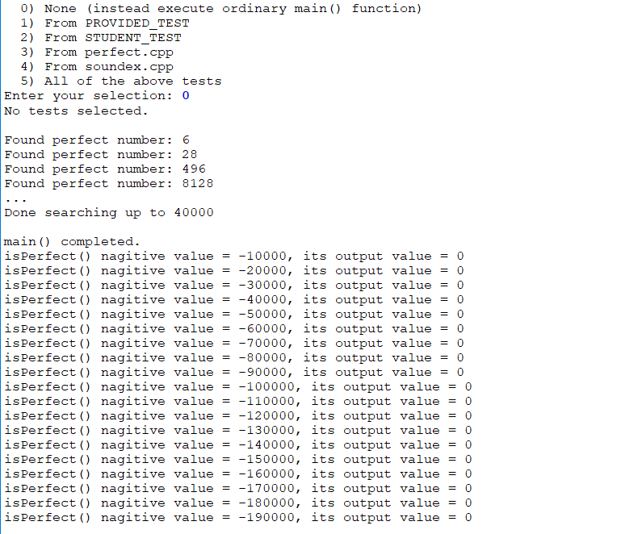
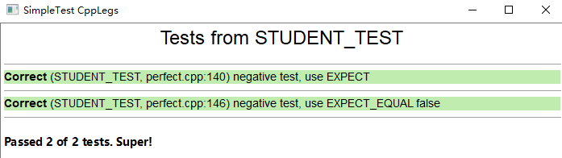
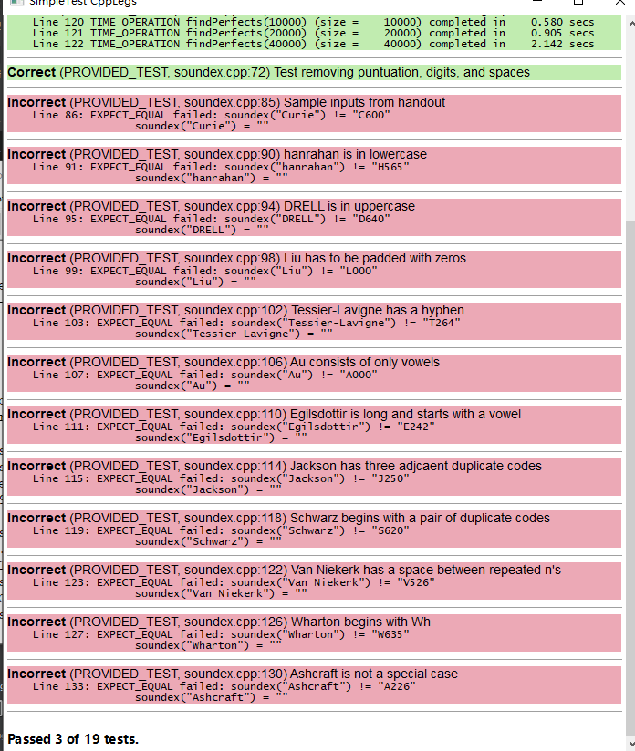
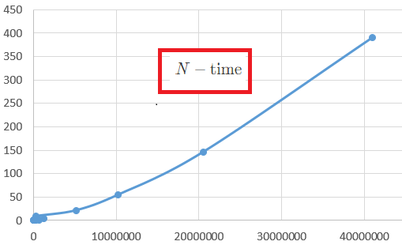
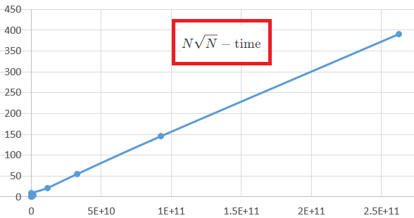

# 作业一


--------------------
### TDD 测试驱动开发
#### 测试选项
- `EXPECT_EQUAL` 确认两个参数是否相等  相等——通过
- `EXPECT` 确认单个表达式是否为真
- `EXPECT_ERROR` 报错  true——通过
- `EXPECT_NO_ERROR` 不报错  执行成功——通过
- `TIME_OPERATION` 操作的执行时间  `TIME_OPERATION(size, expression)`

#### 程序运行选项
- 运行所有测试
- 运行指定测试
- 不运行测试，只执行程序


-------------------------------

### 穷举算法
蛮力搜索，尝试每一个选项

### 问题 1
第一个测试 2.4秒

### 问题 2
尝试添加测试


- 在表格中记录findPerfects的执行时间。

   - 代码运行结果，貌似数据量为1280000时计时器出问题了，因此舍去这一组数据


| 案例 | 数据量大小 | 计算时间 |
| ---- | ---------- | -------- |
| 1    | 10000      | 0.277    |
| 2    | 20000      | 0.591    |
| 3    | 40000      | 1.761    |
| 4    | 80000      | 6.594    |
| 5    | 160000     | 25.029   |
| 6    | 320000     | 98.605   |
| 7    | 640000     | 389.959  |
1. 原始数据 数据量 vs 计算时间

1. 数据量^2 vs 计算时间


3. 拟合得到关系为

$$
t = 9.514681372549019 \times 10^{-10} x^2 + 0.23865098039215127
$$

其中，$x$ 为数据量大小
### 问题 3
1. 对于 10 与 1000，计算 `isPerfect` 做的工作不一样多。 计算 10 时，调用的子函数 `divisorSum` 需要迭代10次，而计算1000时，则需要迭代1000次，明显不一样多。
2. 对于搜索范围为 1-1000 的数，`findPerfect` 其工作量与 1000-2000 时不一致。
   - 我们来计算find运行一次所需要迭代的次数
   - 假设 `findPerfect(stop)` 输入参数为 $stop$，那么这个函数自己就要迭代 $stop$ 次循环。
   - 一次迭代调用一次 `isPerfect(num)` 函数 $num = 1,2,3,..., < stop$
   - 一次 `isPerfect(num)` 又调用一次 `divisorSum(num)` 函数，而 `divisorSum(num)` 函数内，又要迭代 num 次
因此总的迭代次数为

$$
\underbrace{\Sigma_{1}^{stop-1}}_{\text{findPerfect函数}}  \underbrace{1}_{\text{isPerfect函数}} * \underbrace{num}_{\text{divisorSum函数}} \approx \frac{(stop-1-1+1)(stop-1+1)}{2} \sim stop^2 
$$

+ 因此，明显迭代 1000-2000 时工作量更大。

```c++
// 计算所有因数的和（除了它本身），
// 在穷举算法下，输入参数越大，迭代次数越多
long divisorSum(long n) {
    long total = 0;
    for (long divisor = 1; divisor < n; divisor++) {
        if (n % divisor == 0) {
            total += divisor;
        }
    }
    return total;
}

// 判断是否为完全数，一次调用只迭代一次
bool isPerfect(long n) {
    return (n != 0) && (n == divisorSum(n));
}

// 寻找小于 stop 的所有完全数，这个程序迭代 stop 次
void findPerfects(long stop) {
    for (long num = 1; num < stop; num++) {
        if (isPerfect(num)) {
            cout << "Found perfect number: " << num << endl;
        }
        if (num % 10000 == 0) cout << "." << flush; // progress bar
    }
    cout << endl << "Done searching up to " << stop << endl;
}
```


### 问题 4
第五个数大概为 33,000,000，那么代入上面的拟合结果，得到时间约为 1036149 秒，大概为整整 12 天。

### 问题 5

1. 输入负值，看看结果
+ 不妨傻瓜一点，在主函数写一段测试代码，看看负值的结果
```c++
    for (int i = 1;i<20;i++){
        int inputNagitive = i*(-10000);
        cout << "isPerfect() nagitive value = " << inputNagitive
             << ", its output value = " << isPerfect(inputNagitive) << endl;
    }
```
   - 不运行测试，直接运行原程序。可以看到，输入负值输出都为0 (false)。


2. 自己写一个单元测试，测试负值。
   - 由于预期是负值，所以用 `EXPECT_EQUAL` 或者 `EXPECT` 都行，前者需要预期等于 ‘False’，后者表达式取反。

   - 写两个测试，看看结果
```c++
STUDENT_TEST("negative test, use EXPECT") {
    EXPECT(!isPerfect(-1000));
    EXPECT(!isPerfect(-1322320));
    EXPECT(!isPerfect(-432423132));
}

STUDENT_TEST("negative test, use EXPECT_EQUAL false") {
    EXPECT_EQUAL(isPerfect(-1000),0);
    EXPECT_EQUAL(isPerfect(-12), 0);
    EXPECT_EQUAL(isPerfect(-1322320),0);
    EXPECT_EQUAL(isPerfect(-432423132),0);
}
```


3. 把 total 的初始值从 0 改为 1，这将给 divisorSum 引入一个 Bug。重新编译运行一次，可以观察下测试错误时，将会如何报错。
   - 由于刚才的负值测试都会通过，所以运行 PROVIDED_TEST，测试结果如图


4. **问题5**的答案： 这个函数测试失败时，其他测试 **能** 通过，因为每个测试都是独立的小块，互相不影响。


### 问题6

```c++
#include <cmath>
```
加一行头文件，数学库

代码实现如下
```c++
/* TODO: Replace this comment with a descriptive function
 * header comment.
 */
long smarterSum(long n) {
    /* TODO: Fill in this function. */
    long total = 0;
    long sqrtN = floor( sqrt(n));
    for (long divisor = 1; divisor <= sqrtN; divisor++) {
        if (n % divisor == 0) {
            long quotient = n/divisor;
            long sumQuoDiv = ((divisor != quotient && divisor != 1)? divisor + quotient :divisor);
            total += sumQuoDiv ;
        }
    }
    return total;
}
```
+ 思路：
  1. 先取平方（取整），
  2. 然后从1开始，计算商
  3. 当余数为零，则叠加 **商** 和 **除数**。
  4. 叠加的时候将 **1** 和刚好为 **平方根** 的**商**排除

+ 测试思路
   小处出发：只测试 `long smarterSum(long n)` 这一个函数。
   1. 先用 `EXPECT_EQUAL` 测试 输入完全数为真
   2. 再用 `EXPECT_EQUAL` 测试，输入非完全数，测试不通过
   3. 最后用 `EXPECT` 测试表达式相等或者不等的 bool 值。

```c++
STUDENT_TEST("test function smarterSum is true") {
    EXPECT_EQUAL(smarterSum(6),6);
    EXPECT_EQUAL(smarterSum(28),28);
    EXPECT_EQUAL(smarterSum(496),496);
    EXPECT_EQUAL(smarterSum(8128),8128);
    EXPECT_EQUAL(smarterSum(33550336),33550336);
}

STUDENT_TEST("test function smarterSum is false") {
    EXPECT_EQUAL(smarterSum(25),25);
    EXPECT_EQUAL(smarterSum(4),4);
    EXPECT_EQUAL(smarterSum(1000000),1000000);
    EXPECT_EQUAL(smarterSum(625),625);
}

STUDENT_TEST("test function smarterSum, using E") {
    EXPECT (smarterSum(25)!=25);
    EXPECT (smarterSum(4)!=4);
    EXPECT (smarterSum(1000000)!=1000000);
    EXPECT (smarterSum(625)!=625);
    EXPECT (smarterSum(1625)!=1625);
    EXPECT (smarterSum(33550336)==33550336);
}
```
测试结果如下

  
### 问题7
程序执行时间
| 案例 | 数据量大小 | 计算时间 |
| ---- | ---------- | -------- |
| 1    | 10000      | 0.236    |
| 2    | 20000      | 0.234    |
| 3    | 40000      | 0.268    |
| 4    | 80000      | 0.349    |
| 5    | 160000     | 0.523    |
| 6    | 320000     | 0.753    |
| 7    | 640000     | 1.653    |
| 8    | 1280000    | 3.771    |
| 9    | 256000     | 8.643    |
| 10   | 5120000    | 21.261   |
| 11   | 10240000   | 54.856   |
| 12   | 20480000   | 146.032  |
| 13   | 40960000   | 391.396  |


### 问题8

估计一下函数式
1. 对于数据量为 $N$,那么调用一次 'findPerfectsSmarter' 函数，需要调用 `isPerfectSmarter` $N$ 次
2. 调用一次 `isPerfectSmarter` 函数，需要调用一次 `smarterSum` 函数
3. 调用一次 `smarterSum` 函数，需要迭代循环 $\sqrt{N}$ 次
+ 最后估计得到，复杂度约为
$$
N\times 1 \times \sqrt{N} = N^{3/2}
$$

**根据实际记录表，拟合得到的关系式为**
$$
t = 1.64939856150793 \times 10^{-09}*N^{3/2}+0.808507936507936
$$
可以看到，拟合结果误差略大，预期计算到40960000个数据量时的时间为 433s，实际上测试程序用了 391s，误差可以接受，大致得到了比较满意的预测时间结果。





<!-- $$
N - \mathrm{time} \;
N \sqrt{N} - \mathrm{time}
$$ -->

### 问题9
##### 欧几里得优化

**自己写的欧几里得优化函数代码和测试代码如下**
```c++
// ------------ 函数代码
long findNthPerfectEuclid(long n) {
    /* TODO: Fill in this function. */
    int count=0;
    long k=1;
    long long resultNumber=0;
    while(count < n){
        long m = pow(2,k)-1;
        long isPrimeNumber = smarterSum(m);
        //        int count=0;
        if(k > 1 && isPrimeNumber==1){
            resultNumber = pow(2,k-1)*(pow(2,k)-1);
            count ++;
            cout << "The " << count <<"th result is " << resultNumber << endl;
        }
        k++;
    }
    return resultNumber;
}
// ------------ 测试代码
// ----------------- question 9
//findNthPerfectEuclid
STUDENT_TEST("EXPECT_EQUAL, test function findNthPerfectEuclid is true") {
    EXPECT_EQUAL(findNthPerfectEuclid(1),6);
    EXPECT_EQUAL(findNthPerfectEuclid(2),28);
    EXPECT_EQUAL(findNthPerfectEuclid(3),496);
    EXPECT_EQUAL(findNthPerfectEuclid(4),8128);
    EXPECT_EQUAL(findNthPerfectEuclid(5),33550336);
    EXPECT_EQUAL(findNthPerfectEuclid(6),8589869056);
    EXPECT_EQUAL(findNthPerfectEuclid(7),137438691328);
}
//findNthPerfectEuclid
STUDENT_TEST("EXPECT, test function findNthPerfectEuclid is true") {
    EXPECT(findNthPerfectEuclid(1)==6);
    EXPECT(findNthPerfectEuclid(2)==28);
    EXPECT(findNthPerfectEuclid(3)==496);
    EXPECT(findNthPerfectEuclid(4)==8128);
    EXPECT(findNthPerfectEuclid(5)==33550336);
    EXPECT(findNthPerfectEuclid(6)==8589869056);
    EXPECT(findNthPerfectEuclid(7)==137438691328);
}
//findNthPerfectEuclid
STUDENT_TEST("EXPECT, test function findNthPerfectEuclid using the incorrect values") {
    EXPECT(findNthPerfectEuclid(1)!=1+6);
    EXPECT(findNthPerfectEuclid(2)!=1+28);
    EXPECT(findNthPerfectEuclid(3)!=1+496);
    EXPECT(findNthPerfectEuclid(4)!=1+8128);
    EXPECT(findNthPerfectEuclid(5)!=1+33550336);
    EXPECT(findNthPerfectEuclid(6)!=1+8589869056);
    EXPECT(findNthPerfectEuclid(7)!=1+137438691328);
}
```
给了三个测试
1. 用 `EXPECT_EQUAL` 测试第 n 个完全数是正确的，——测试通过。
2. 用  `EXPECT` 测试第 n 个完全数是正确的，——测试前6个完全数通过，但是第 7 个貌似发生了溢出。**很好奇，明明前面的 测试通过了，换到这个，判断布尔值反而不通过了**。
3. 用 `EXPECT` 测试 不正确的完全数，利用 `!=` 判断程序的正确性——测试通过。


**事实上，上面的 `long` 整型变量可能会出现溢出，又重写了一个 `long long findNthPerfectEuclidLongLong(long n)` 函数，把原来的返回值换成 `long long`**
```c++
// ------------ 函数代码
// 把返回值换成 long long 长整型，防止溢出
long long findNthPerfectEuclidLongLong(long n) {
    /* TODO: Fill in this function. */
    int count=0;
    long k=1;
    long long resultNumber=0;
    while(count < n){
        long m = pow(2,k)-1;
        long isPrimeNumber = smarterSum(m);
        //        int count=0;
        if(k > 1 && isPrimeNumber==1){
            resultNumber = pow(2,k-1)*(pow(2,k)-1);
            count ++;
            cout << "The " << count <<"th result is " << resultNumber << endl;
        }
        k++;
    }
    return resultNumber;
}

// ------------ 测试代码
//findNthPerfectEuclidLongLong
STUDENT_TEST("test function findNthPerfectEuclidLongLong is true") {
    EXPECT(findNthPerfectEuclidLongLong(1)==6);
    EXPECT(findNthPerfectEuclidLongLong(2)==28);
    EXPECT(findNthPerfectEuclidLongLong(3)==496);
    EXPECT(findNthPerfectEuclidLongLong(4)==8128);
    EXPECT(findNthPerfectEuclidLongLong(5)==33550336);
    EXPECT(findNthPerfectEuclidLongLong(6)==8589869056);
    EXPECT(findNthPerfectEuclidLongLong(7)==137438691328);
}
```
用函数 `findNthPerfectEuclidLongLong` 重试上面的第二个测试，通过。


**解释为什么这几个测试能够确认 `` 函数正确工作：** 因为这个测试既包括了测试正确的完全数值，又测试了不正确的完全数值。


🍩 第二部分 姓氏编码检索程序

### 问题10
**Angelou** 的编码 是 **A524**

### 问题11
 在写代码之前，自行进行头脑风暴，尝试把这个任务分解成几个小任务。简单描述一下你的分解过程。

 1. 输入姓氏
 2. 去除非字符 （横线、空格、标点）
 3. 对每个字母寻找相应编码数字
 4. 去重复
 5. 把第一个数字替换为姓氏大写字母
 6. 删除0
 7. 截取4位之后的数字或者补零，得到四位编码


### 问题12
<!-- 1. 如果你试图实现一个一次性完成整个 Soundex 算法的函数，你可能会得到一段又大又笨拙的代码
2. 但是，如果你将问题分解为许多不同的步骤，每个步骤对应一个辅助函数，那么你就可以一次只关注一个辅助函数，编写并测试。
3. 在编写测试时，目标是列举一组全面的测试，这些测试将代码中的任何 bug 暴露出来
4. 一个伟大的开发人员不仅是一个伟大的程序员，也是一个伟大的测试人员。 -->

通过调整测试，发现类似这样的 bug

- bug 1
```c++
s = "    ";
result = removeNonLetters(s);
EXPECT_EQUAL(result, "");

!!!!!!!!!!!!
Line 149: EXPECT_EQUAL failed: result != ""
                result = " "
```

bug 应该是如果字符串首有几个空格，最后会在前面剩下一个空格。

把函数调整为下面的形式，然后就解决了这个bug。
```c++
string removeNonLetters(string s)
{
    string result = charToString(s[0]);
    for (int i = 1; i < s.length(); i++)
    {
        if (isalpha(s[i]))
        {
            result += s[i];
        }
    }
    // 加入这一行，判断执行之后首字母是不是空格，如果是，删去
    if (result.at(0) == ' ')
    {
        result = result.substr(1, string::npos);
    }
    return result;
}
```

#### `soundex` 函数具体的实现思路和代码给出如下
 1. 去除非字符 （横线、空格、标点）
```c++
// 代码如上
```
 2. 对每个字母寻找相应编码数字
```c++
int getDigit(char inputSingleChar)
{
    string str0 = "AEIOUHWY";
    string str1 = "BFPV";
    string str2 = "CGJKQSXZ";
    string str3 = "DT";
    string str4 = "L";
    string str5 = "MN";
    string str6 = "R";
    string strArray[] = {str0, str1, str2, str3, str4, str5, str6};
    int res = 0;

    for (int i = 0; i < 7; i++)
    {
        if (strArray[i].find(toupper(inputSingleChar)) != strArray[i].npos)
        {
            res = i;
            break;
        }
    }
    return res;
}
// 3. 对每个字母寻找相应编码数字
string getOriginalDigits(string inputSurname)
{

    int sizeInput = inputSurname.size();
    string outSurname = "";
    for (int i = 0; i < sizeInput; i++)
    {
        string a = std::to_string(getDigit(inputSurname[i]));
        outSurname.push_back(a.at(0));
    }
    //    outSurname.at(0) = toupper(inputSurname[0]);
    cout << outSurname << endl;
    return outSurname;
}
```
 3. 去重复
```c++
string removeDuplicationAndAdjacent(string inputSurname)
{
    int sizeInput = inputSurname.size();
    string outSurname = inputSurname.substr(0, 1);
    for (int i = 0; i < sizeInput - 1; i++)
    {
        if (inputSurname[i + 1] != inputSurname[i])
        {
            outSurname.push_back(inputSurname[i + 1]);
        }
        else
        {
        }
    }
    return outSurname;
}
```

 4. 把第一个数字替换为姓氏大写字母
```c++
string substituteFirstDigitToUpperLetter(string inputSurname, string inputDigits)
{
    string outSurname = inputDigits;
    outSurname.at(0) = toupper(inputSurname.at(0));
    return outSurname;
}
```
 5. 删除0
```c++
string deleteZeroInDigits(string inputSurname)
{
    int sizeInput = inputSurname.size();
    string outSurname = inputSurname.substr(0, 1);
    for (int i = 0; i < sizeInput - 1; i++)
    {
        if (inputSurname[i + 1] != '0')
        {
            outSurname.push_back(inputSurname[i + 1]);
        }
        else
        {
        }
    }
    return outSurname;
}
```
 6. 截取4位之后的数字或者补零，得到四位编码
```c++
string getLength4(string inputSurname)
{
    int sizeInput = inputSurname.size();
    string outResult;
    if (sizeInput >= 4)
    {
        outResult = inputSurname.substr(0, 4);
    }
    else
    {
        outResult = inputSurname += ("0000");
        outResult = outResult.substr(0, 4);
    }
    return outResult;
}
```
##### 汇总起来，就得到了 `soundex` 函数
```c++
string soundex(string s)
{
    string inputSurname = s;
    inputSurname = removeNonLetters(s);
    inputSurname = getOriginalDigits(inputSurname);
    inputSurname = removeDuplicationAndAdjacent(inputSurname);
    inputSurname = substituteFirstDigitToUpperLetter(s, inputSurname);
    inputSurname = deleteZeroInDigits(inputSurname);
    /* TODO: Fill in this function. */
    return getLength4(inputSurname);
    // return "";
}
```

利用这个函数，之前的 `PROVIDED_TEST` 全部通过


##### 最后一个测试，开发一个检索程序
